# 외장스토리지에 부트캠프(Windows to go) 설치하기

## 외장 스토리지 초기화 시키기

diskutil 명령을 이용해서 디스크 디바이스를 확인하자

```bash
diskutil list
```

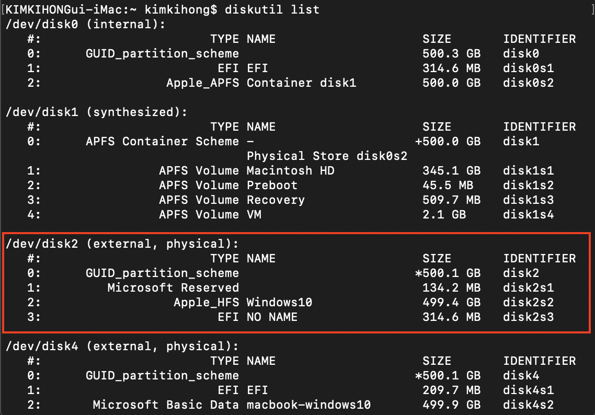

```bash
# 이름이 없는 disk2를 초기화시킨다
diskutil erasedisk free Untitled disk2
```


`diskutil list` 명령을 다시 실행하여 결과를 본다

```bash
diskutil list
```

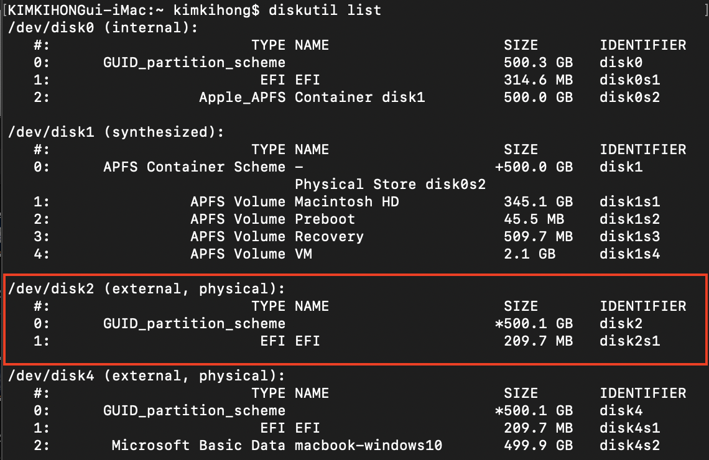
깔끔하게 초기화 되었다

## 파티션 나누기

Windows에 접속하여 외장스토리지 파티션 나누기 및 볼륨 생성하기


할당되지 않은 볼륨을 선택하고 마우스 우클릭 -> 새 단순 볼륨을 선택한다

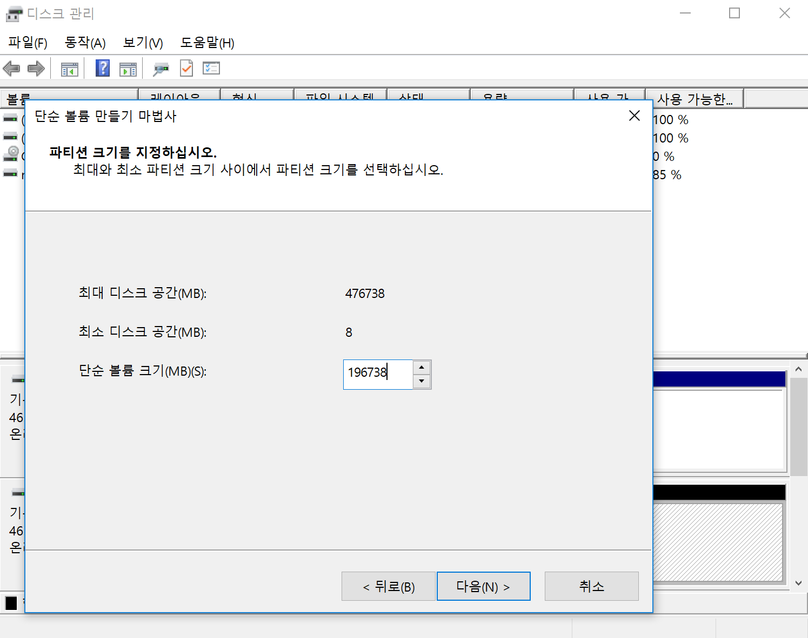
드라이브 문자 또는 드라이브 경로를 할당하지 않음 선택한다

단순 볼륨 크기 지정한다  
192기가만큼 파티션을 나눴다
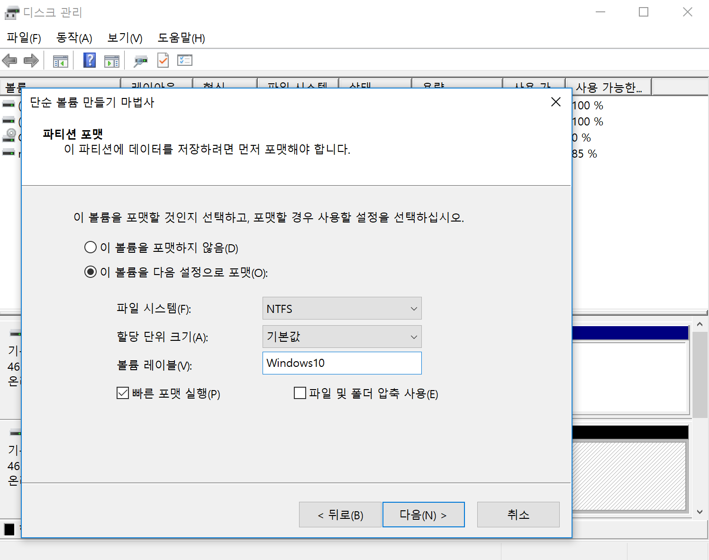
원하는 볼륨 레이블을 입력한다
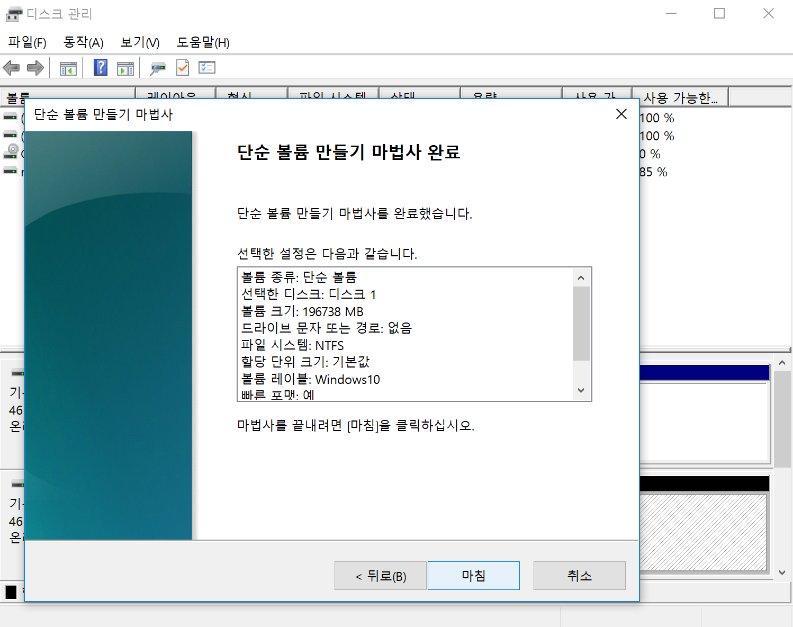
마침을 누른다

정상적으로 파티션이 생성된 것을 볼 수 있다

## WintoUSB 설치

WintoUSB를 이용해서 외장스토리지에 Windows10을 설치할 것이다

공식웹페이지  
<https://www.easyuefi.com/wintousb/>
프리웨어이지만 최신 버전은 windows10 설치가 막혀있다  
3.9버전 아래로 설치해야한다

<https://wintousb.kr.uptodown.com/windows>
위 링크에서 3.9버전을 받을 수 있다

파일을 다운받은 후 설치하자

## WintoUSB를 이용해 외장스토리지에 Windows10 설치하기

WintoUSB를 실행시킨다

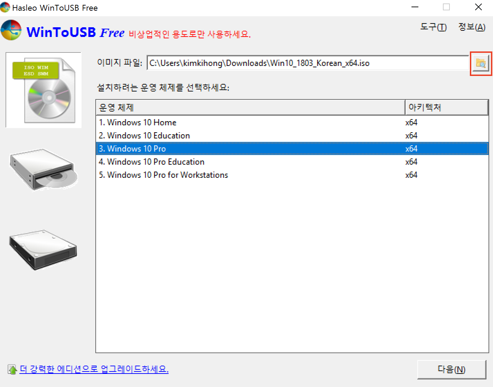
window10 이미지파일 경로를 지정한 뒤 설치하려는 운영체제를 선택한다

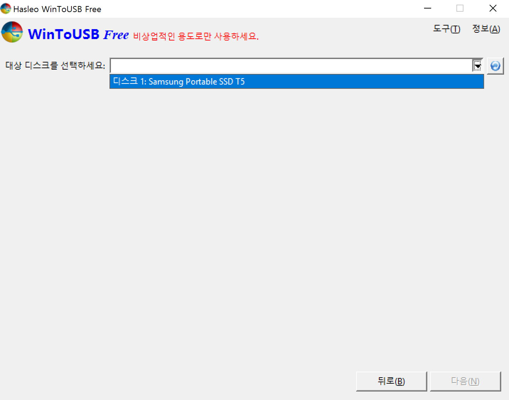
외장스토리지를 선택한다

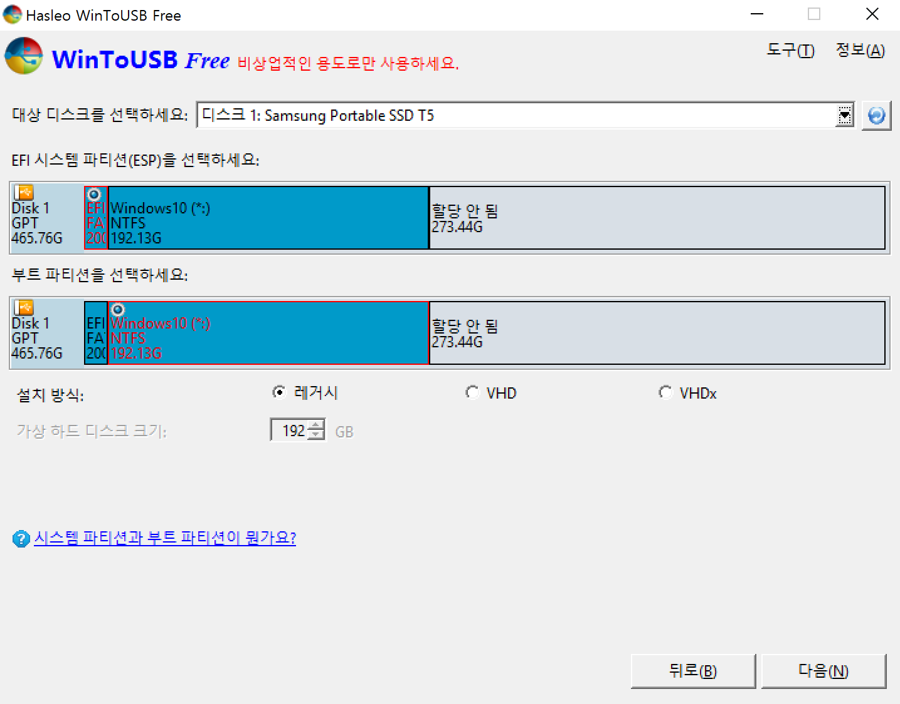
EFI 시스템 파티션과 부트 파티션을 선택한다

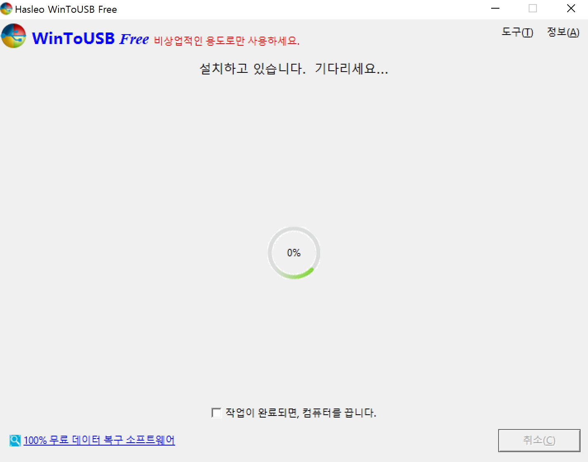
설치를 시작한다

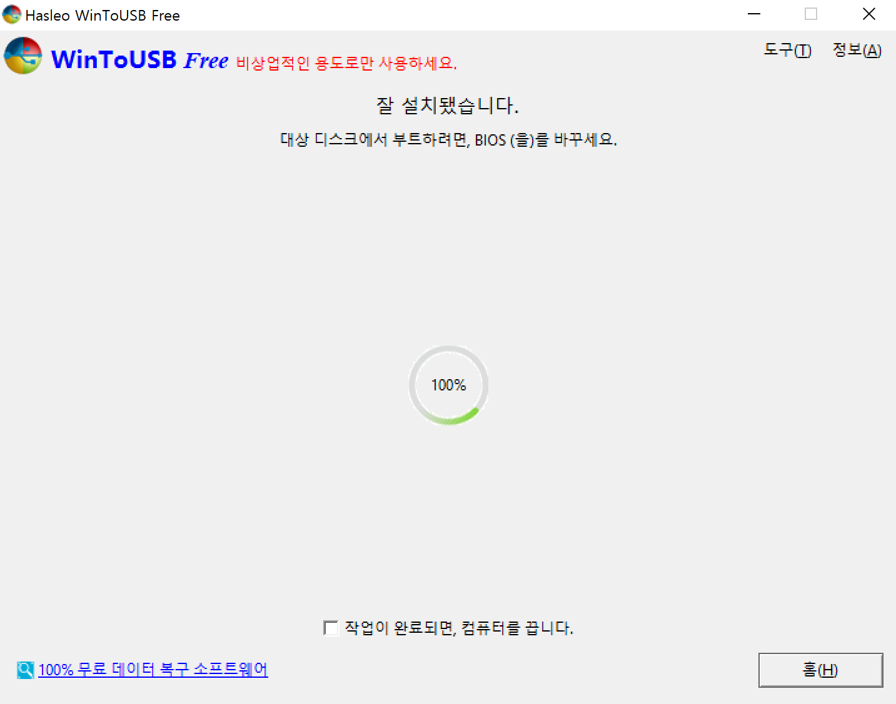
설치가 완료되었다

## Windows 지원 소프트웨어를 다운로드한다

맥 시스템 드라이버가 포홤되어있다. 반드시 받아서 윈도우에 설치해주자
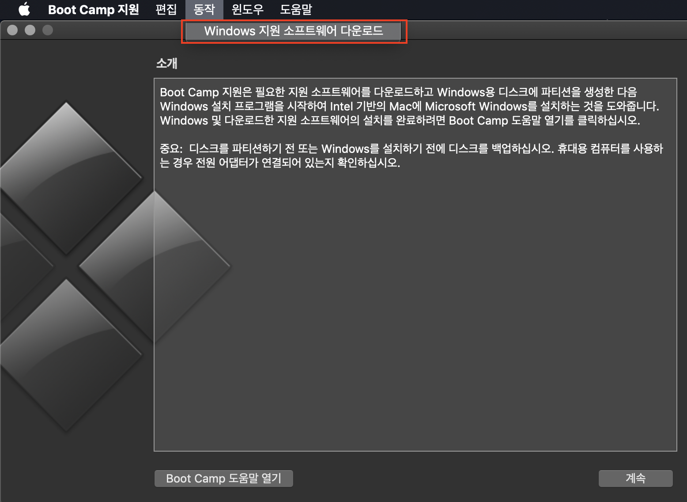

## Windows10으로 부팅하기

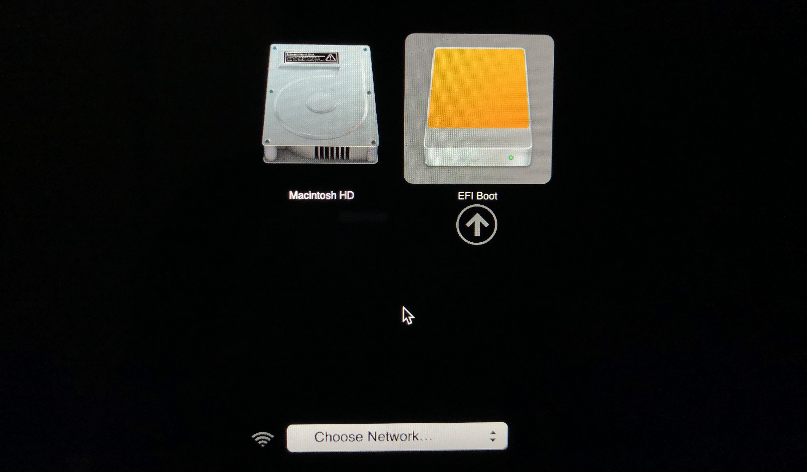

맥 부팅시에 옵션키를 누르면 부팅 디스크 선택이 나온다.


윈도우즈10이 정상 설치 되었다


아까 받은 Boot Camp 설치 프로그램을 실행한다

## Windows10 업데이트 하기

레지스트리 편집기 `regedit.exe` 실행

> HKEY_LOCAL_MACHINE\SYSTEM\CurrentControlSet\Control

PortableOperatingSystem 값을 0으로 수정

---

파티션하고 남은 부분은 맥에서 파티션 및 볼륨 지정하여 외장스토리지로 사용을 하자
