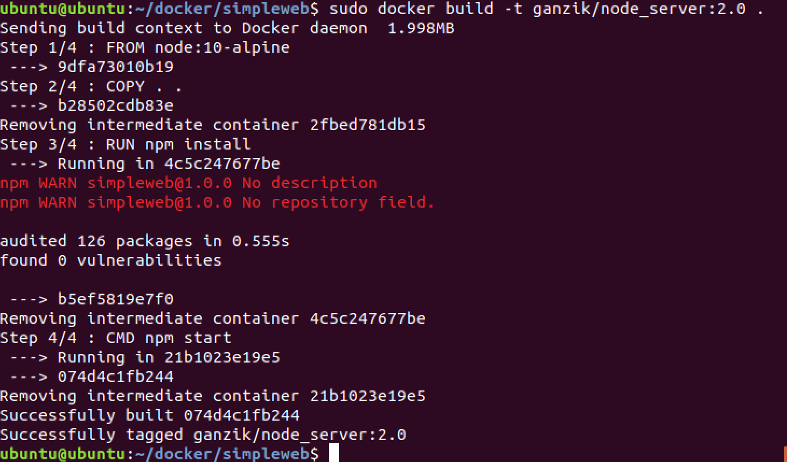
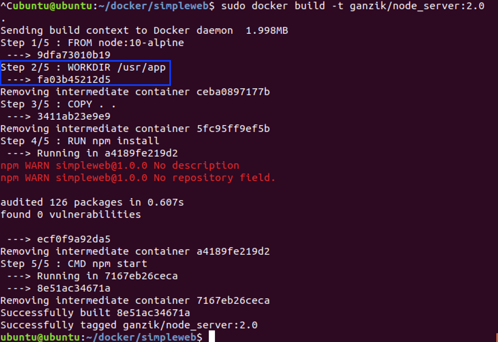

# docker 인프라 구축

## NVM 설치하기

<https://github.com/nvm-sh/nvm>

```bash
curl -o- https://raw.githubusercontent.com/nvm-sh/nvm/v0.34.0/install.sh | bash
```

## NVM 설치 활성화하기

```bash
source ~/.profile
nvm ls-remote
```

## NodeJS 설치하기

```bash
nvm install 10.14.2
```

## NodeJS 설치 확인하기

```bash
node -v
```

## NodeJS 삭제하기

```bash
# nvm 확인하기
nvm current
v10.14.2

nvm uninstall v10.14.2
```

---

## simpleweb 프로젝트 생성

```bash
mkdir simpleweb
cd simpleweb

# package.json 생성
npm init

# express 모듈 설치
npm install --save express
```

## package.json 파일 확인 및 수정 (start script 추가)

```json
{
  "name": "simpleweb",
  "version": "1.0.0",
  "description": "",
  "main": "index.js",
  "scripts": {
    "test": "echo \"Error: no test specified\" && exit 1",
    "start": "node app.js"
  },
  "author": "",
  "license": "ISC",
  "dependencies": {
    "express": "^4.17.1"
  }
}
```

## app.js 파일 추가

```js
const express = require("express");

const app = express();

app.get("/", (req, res) => {
  res.send("Hi there");
});

app.listen(8080, () => {
  console.log("Listening at 8080");
});
```

## Node 서버 동작 확인

```bash
node app.js
# or
npm start
```

## 브라우저에서 확인

> http://localhost:8080

---

Docker container에서 nodejs 실행

## Dockerfile 생성

```bash
# Specify a base image
FROM alpine

# Install some dependencies
RUN npm Install

# Default command
CMD ["npm", "start"]
```

## Docker build

```bash
sudo docker build -t ganzik/node_server:1.0 .
```


오류를 내뿜으며 안된다

## base 이미지 변경 - Dockerfile 수정

```bash
# Specify a base image
FROM node:10-alpine

# Install some dependencies
RUN npm install

# Default command
CMD ["npm", "start"]
```


오류를 내뿜으며 안된다

## Dockerfile수정 package.json 파일 복사

```bash
# Specify a base image
FROM node:10-alpine

# Install some dependencies
COPY . .
RUN npm install

# Default command
CMD ["npm", "start"]
```

## 다시 이미지를 빌드

```bash
sudo docker build -t ganzik/node_server:2.0 .
```



## 동작 확인

```bash
sudo docker run ganzik/node_server:2.0
```


```bash
sudo docker ps
```


## 생성한 컨테이너 접속

```bash
# d05컨테이너에 접속해서 실행한다
sudo docker exec -it d05 sh
```


Dockerfile에서 명령한 cp . . 을 통해 호스트파일(/home/ubuntu/docker/simpleweb/)이 컨테이너의 / 폴더에 복사되어 있는것을 확인 할 수 있다.  
Dockerfile을 통해 디렉토리를 지정해서 복사 할 수 있다

---

## work dir 변경

Dockerfile을 수정한다

```bash
# Specify a base image
FROM node:10-alpine

WORKDIR /usr/app

# Install some dependencies
COPY . .
RUN npm install

# Default command
CMD ["npm", "start"]
```

```bash
# 이미지를 다시 빌드한다
sudo docker build -t ganzik:node_server:2.0 .
```



```bash
# 컨테이너를 다시 실행
sudo docker run ganzik/node_server:2.0
```


```bash
# 실행중인 도커 컨테이너 프로세스 확인
sudo docker ps

# 27b 컨테이너에 접속해서 sh 실행
sudo docker exec -it 27b sh
```


---

## Dockerfile 최적화

## 프로젝트 생성

```
# 디렉터리 생성 후 이동
mkdir optimiseweb
cd optimiseweb

# npm 패키지 초기 설정
npm init

# express 모듈 설치
npm install --save express
```

### Dockerfile 작성

```docker
# Specify a base image
FROM node:10-alpine

WORKDIR /usr/app

# Install some dependencies
COPY ./ ./
RUN npm install

# Default command
CMD ["npm", "start"]
```

### app.js 파일 작성

```js
const express = require("express");

const app = express();

app.get("/", (req, res) => {
  res.send("Hi there");
});

app.listen(8080, () => {
  console.log("Listening at 8080");
});
```

### package.json 파일 작성

```json
{
  "name": "simpleweb",
  "version": "1.0.0",
  "description": "",
  "main": "index.js",
  "scripts": {
    "test": "echo \"Error: no test specified\" && exit 1",
    "start": "node app.js"
  },
  "author": "",
  "license": "ISC",
  "dependencies": {
    "express": "^4.17.1"
  }
}
```

## Docker 이미지 빌드

```bash
sudo docker build -t ganzik/optimiseweb:1.0 .
```


### app.js 내용 수정해서 다시 이미지 빌드하기


```bash
sudo docker build -t optimiseweb:2.0 .
```


### 이슈

App.js 파일을 수정했는데 package를 다시 install 하고 있다.

### 원인

COPY . . 이 되면서 이 되면서수정된 app.js 파일이 복사되어 기존 캐싱된 이미지와 달라 이후 새로 빌드 진행

### 해결

App.js 파일과 같이 package 인스톨과 관계 없는 파일은 package install 한 다음에 복사

```bash
# /home/ubuntu/docker/optimiseweb/ 디렉터리에 패키지 인스톨 및 express모듈 설치
npm init

npm install -save express
```

## Dockerfile 수정

```docker
FROM node:10-alpine

WORKDIR /usr/app

# Install some dependencies
COPY ./package.json ./
RUN npm install
COPY ./ ./

# Default command
CMD ["npm", "start"]
```

### app.js 내용 수정해서 다시 이미지 빌드하기


## Docker 이미지 다시 빌드

```bash
sudo docker build -t optimiseweb:3.0 .
```


