# docker 인프라 구축

## NVM 설치하기

<https://github.com/nvm-sh/nvm>

```bash
curl -o- https://raw.githubusercontent.com/nvm-sh/nvm/v0.34.0/install.sh | bash
```

## NVM 설치 활성화하기

```bash
source ~/.profile
nvm ls-remote
```

## nodejs 설치하기

```bash
nvm install 10.14.2
```

## nodejs 설치 확인하기

```bash
node -v
```

## nodejs 삭제하기

```bash
# nvm 확인하기
nvm current
v10.14.2

nvm uninstall v10.14.2
```

---

## simpleweb 프로젝트 생성

```bash
mkdir simpleweb
cd simpleweb

# package.json 생성
npm init

# express 모듈 설치
npm install --save express
```

## package.json 파일 확인 및 수정 (start script 추가)

```json
{
  "name": "simpleweb",
  "version": "1.0.0",
  "description": "",
  "main": "index.js",
  "scripts": {
    "test": "echo \"Error: no test specified\" && exit 1",
    "start": "node app.js"
  },
  "author": "",
  "license": "ISC",
  "dependencies": {
    "express": "^4.17.1"
  }
}
```

## app.js 파일 추가

```js
const express = require("express");

const app = express();

app.get("/", (req, res) => {
  res.send("Hi there");
});

app.listen(8080, () => {
  console.log("Listening at 8080");
});
```

## Node 서버 동작 확인

```bash
node app.js
# or
npm start
```

## 브라우저에서 확인

> http://localhost:8080

---

Docker container에서 nodejs 실행

## Dockerfile 생성

```bash
# Specify a base image
FROM alpine

# Install some dependencies
RUN npm Install

# Default command
CMD ["npm", "start"]
```

## Docker build

```bash
sudo docker build -t ganzik/node_server:1.0 .
```


오류를 내뿜으며 안된다

## base 이미지 변경 - Dockerfile 수정

```bash
# Specify a base image
FROM node:10-alpine

# Install some dependencies
RUN npm install

# Default command
CMD ["npm", "start"]
```

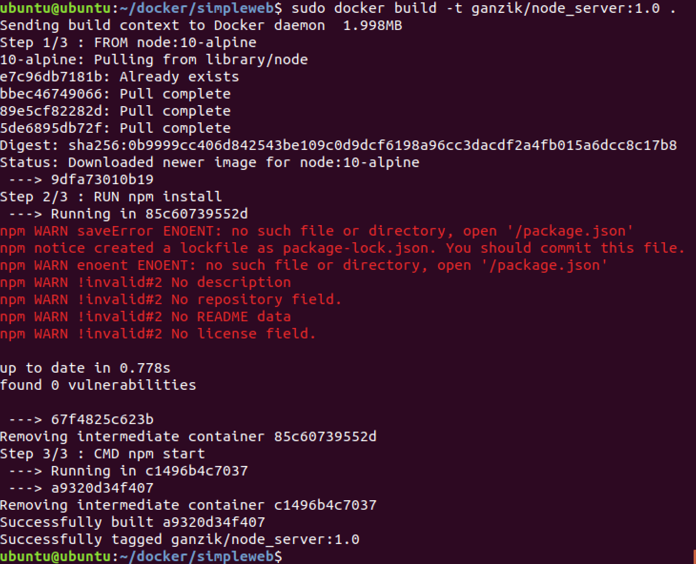
오류를 내뿜으며 안된다

## Dockerfile수정 package.json 파일 복사

```bash
# Specify a base image
FROM node:10-alpine

# Install some dependencies
COPY . .
RUN npm install

# Default command
CMD ["npm", "start"]
```

## 다시 이미지를 빌드

```bash
sudo docker build -t ganzik/node_server:2.0 .
```


## 동작 확인

```bash
sudo docker run ganzik/node_server:2.0
```


```bash
sudo docker ps
```


## 생성한 컨테이너 접속

```bash
# d05컨테이너에 접속해서 실행한다
sudo docker exec -it d05 sh
```


Dockerfile에서 명령한 cp . . 을 통해 호스트파일(/home/ubuntu/docker/simpleweb/)이 컨테이너의 / 폴더에 복사되어 있는것을 확인 할 수 있다.  
Dockerfile을 통해 디렉토리를 지정해서 복사 할 수 있다

---

## work dir 변경

Dockerfile을 수정한다

```bash
# Specify a base image
FROM node:10-alpine

WORKDIR /usr/app

# Install some dependencies
COPY . .
RUN npm install

# Default command
CMD ["npm", "start"]
```

```bash
# 이미지를 다시 빌드한다
sudo docker build -t ganzik:node_server:2.0 .
```


```bash
# 컨테이너를 다시 실행
sudo docker run ganzik/node_server:2.0
```


```bash
# 실행중인 도커 컨테이너 프로세스 확인
sudo docker ps

# 27b 컨테이너에 접속해서 sh 실행
sudo docker exec -it 27b sh
```


---

## Dockerfile 최적화

## 프로젝트 생성

```
# 디렉터리 생성 후 이동
mkdir optimiseweb
cd optimiseweb

# npm 패키지 초기 설정
npm init

# express 모듈 설치
npm install --save express
```

### Dockerfile 작성

```docker
# Specify a base image
FROM node:10-alpine

WORKDIR /usr/app

# Install some dependencies
COPY ./ ./
RUN npm install

# Default command
CMD ["npm", "start"]
```

### app.js 파일 작성

```js
const express = require("express");

const app = express();

app.get("/", (req, res) => {
  res.send("Hi there");
});

app.listen(8080, () => {
  console.log("Listening at 8080");
});
```

### package.json 파일 작성

```json
{
  "name": "simpleweb",
  "version": "1.0.0",
  "description": "",
  "main": "index.js",
  "scripts": {
    "test": "echo \"Error: no test specified\" && exit 1",
    "start": "node app.js"
  },
  "author": "",
  "license": "ISC",
  "dependencies": {
    "express": "^4.17.1"
  }
}
```

## Docker 이미지 빌드

```bash
sudo docker build -t ganzik/optimiseweb:1.0 .
```

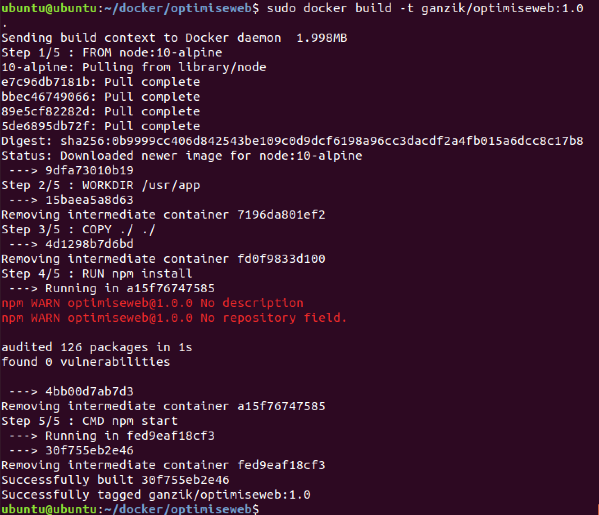

### app.js 내용 수정해서 다시 이미지 빌드하기


```bash
sudo docker build -t optimiseweb:2.0 .
```


### 이슈

App.js 파일을 수정했는데 package를 다시 install 하고 있다.

### 원인

COPY . . 이 되면서 이 되면서수정된 app.js 파일이 복사되어 기존 캐싱된 이미지와 달라 이후 새로 빌드 진행

### 해결

App.js 파일과 같이 package 인스톨과 관계 없는 파일은 package install 한 다음에 복사

```bash
# /home/ubuntu/docker/optimiseweb/ 디렉터리에 패키지 인스톨 및 express모듈 설치
npm init

npm install -save express
```

## Dockerfile 수정

```docker
FROM node:10-alpine

WORKDIR /usr/app

# Install some dependencies
COPY ./package.json ./
RUN npm install
COPY ./ ./

# Default command
CMD ["npm", "start"]
```

### app.js 내용 수정해서 다시 이미지 빌드하기


## Docker 이미지 다시 빌드

```bash
sudo docker build -t optimiseweb:3.0 .
```


---

## Node - Redis 연동하기

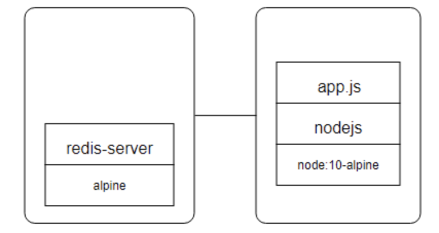

컨테이너 두 개를 띄워서 서로 연동하는 것을 실습해보자

redis-server 컨테이너는 데이터베이스를 저장하는 redis가 작동하게 하고
nodejs 컨테이너는 Dockerfile을 이용해서 실행되도록한다
그리고 그 둘을 연결해서 nodejs에서 서비스하는 웹 방문자 카운터를 redis-server 컨테이너 redis 데이터베이스에 저장해보자

### 프로젝트 생성

/home/ubuntu/docker/ 디렉터리에서 프로젝트를 위한 하위 디렉터리를 하나 생성하고 npm을 이용해 초기 설정 및 모듈을 설치하자

```bash
mkdir node_redis
cd node_redis
npm init
npm install --save express
npm install --save redis
```

### app.js 작성

```js
const express = require("express");
const redis = require("redis");

const app = express();

const client = redis.createClient();
client.set("visits", 0);

app.get("/", (req, res) => {
  client.get("visits", (err, visits) => {
    res.send("Number of visit is " + visits);
    client.set("visits", parseInt(visits) + 1);
  });
});

app.listen(8081, () => {
  console.log("Listening 8081 port");
});
```

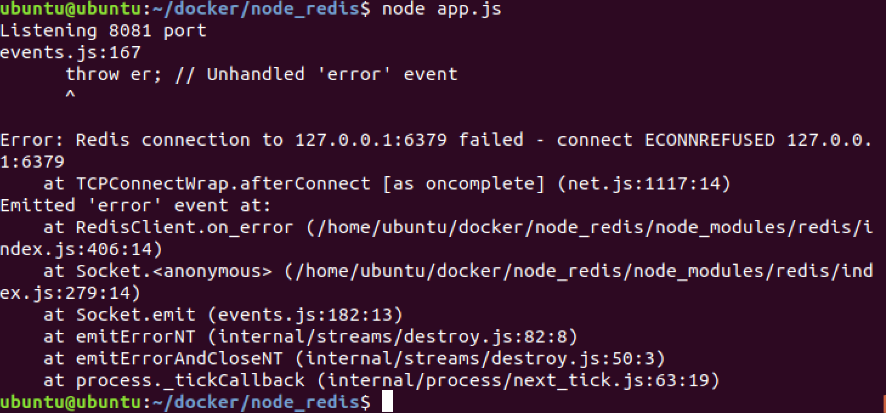
redis가 없어서 에러를 발생한다

### redis-server 설치

```bash
sudo apt-get install redis-server
```

### redis-server 실행

```bash
redis-server
```

### redis 동작 확인

새터미널을 열어서 입력

```bash
redis-cli
```


### app.js 동작 확인

```bash
node app.js
```


브라우저에서 `http://localhost:8081` 입력한다


## Docker 컨테이너 올리기

### Dockerfile 작성하기

```docker
FROM node:10-alpine

WORKDIR '/app'

# Install some dependencies
COPY ./package.json ./
RUN npm install
COPY ./ ./

# Default command
CMD ["npm", "start"]
```

### Docker 이미지 빌드하기

```bash
sudo docker build -t ganzik/node_redis:1.0 .
```

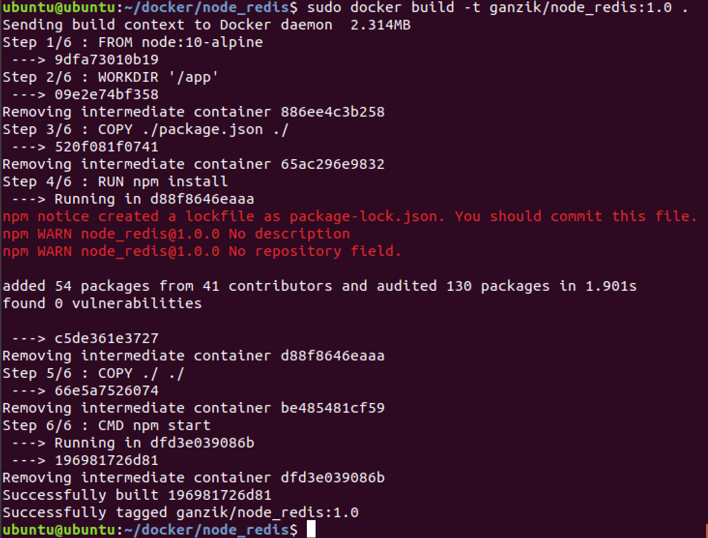

도커 컨테이너 올리기

```bash
sudo docker run -it ganzik/node_redis:1.0
```


오류를 나타낸다

### Docker-compose 파일 작성

docker-compose.yml

```yml
# docker-compose 버전을 지정한다
version: "3"
# service를 제공할 컨테이너를 작성한다
services:
  # 컨테이너 이름은 redis-server
  redis-server:
    # "redis"라는 이미지를 이용해서 생성한다
    image: "redis"
  # 컨테이너 이름은 node-app
  node-app:
    # 현재 디렉터리의 Dockerfile을 이용해서 생성한다
    build: .
    # 호스트 포트 8081과 컨테이너 포트 8081을 맵핑해서 연결한다
    ports:
      - 8081:8081
```

### docker-compose 설치

```bash
sudo apt-get install docker-compose
```

### docker-compose 실행

```bash
sudo docker-compose up --build
```

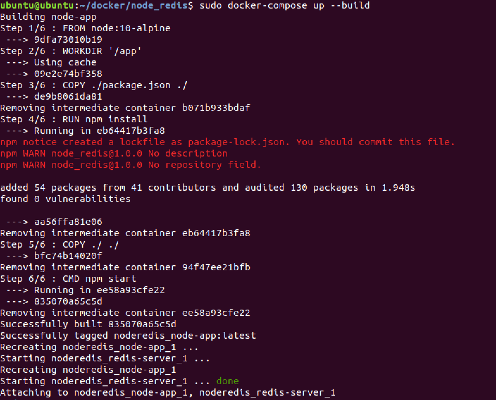
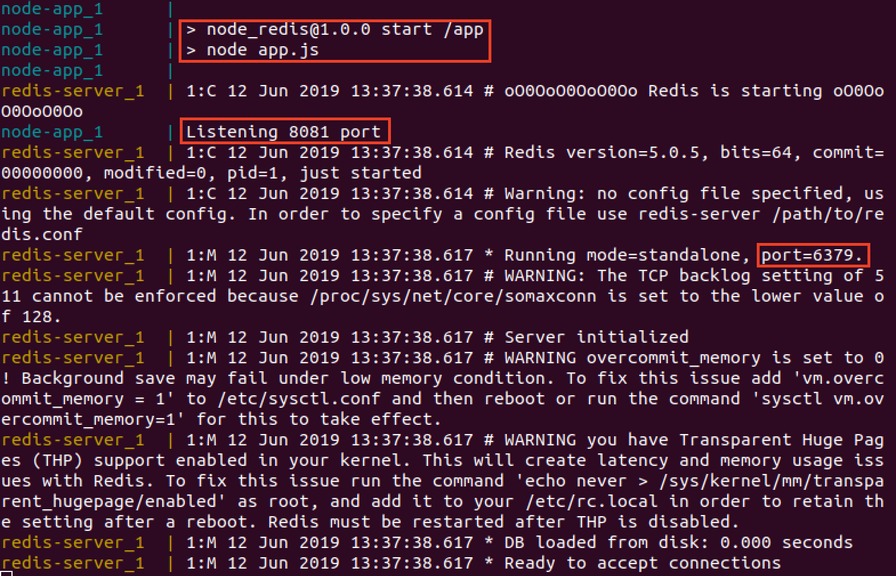

node-app 컨테이너와 redis-server 컨테이너 연결을 위해 "redis-server"포트를 입력해준다

app.js 수정해준다

```js
const client = redis.createClient({
  host: "redis-server",
  port: 6379
});
```

---

## Apache 서버 (ubuntu 16.04)

Dockerfile

```bash
FROM ubuntu:16.04

MAINTAINER ubuntu

LABEL "purpose"="practice"

WORKDIR /var/www/html

RUN apt-get update
RUN apt-get install apache2 -y
RUN ["/bin/bash", "-c", "echo hello >> test2.html"]

EXPOSE 80

CMD apachectl -DFOREGROUND
```

### 도커 빌드 및 실행

```bash
sudo docker build -t ganzik/apache_server:1.0 .

sudo docker run ganzik/apache_server:1.0
```


브라우저에 주소를 입력하면 apache2 서버에 정상 접속된다
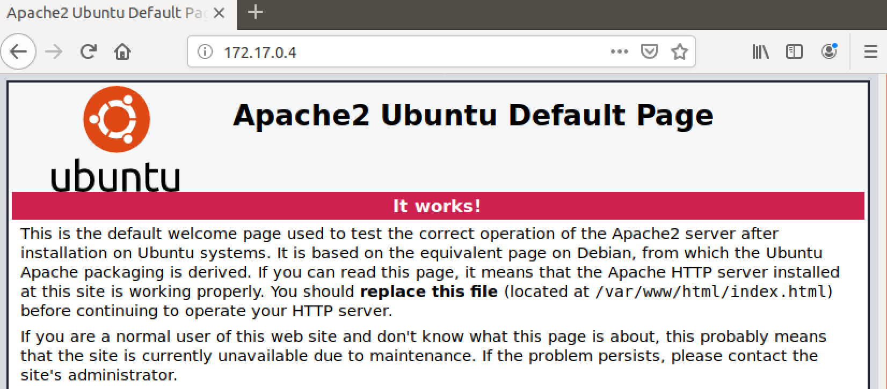

---

## Apache 서버 두번째 방법 (httpd)

### Dockerfile 작성

참조 <https://hub.docker.com/_/httpd>

```docker
FROM httpd:2.4
COPY ./public-html /usr/local/apache2/htdocs/
```

### index.html 파일

```bash
mkdir public-html
cd public-html
vim index.html
```

index.html

```html
<html lang="en"></html>
<head>
  <meta charset="UTF-8" />
  <meta name="viewport" content="width=device-width, initial-scale=1.0" />
  <meta http-equiv="X-UA-Compatible" content="ie=edge" />
  <title>Document</title>
</head>
<body>
  Hello world
</body>
```

### docker 이미지 빌드 및 컨테이너 실행

```bahs
sudo docker build -t my-apache2 .

sudo docker run -dit --name my_apache -p 8080:80 my-apache2
```

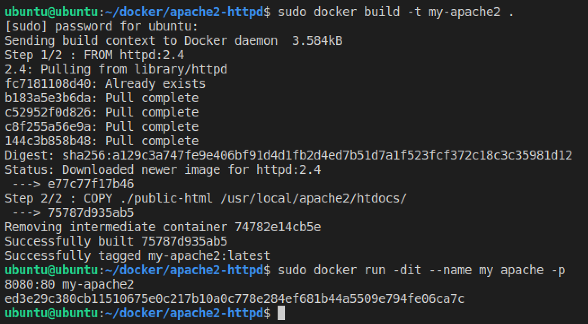

### 확인

브라우저에서 `http://localhost:8080` 입력


---

## MySQL 서버 구축

```bash
# 도커 컨테이너를 바로 실행한다. root password는 0918, 그리고 데이터베이스를 wordpress를 생성한다
sudo docker run -d --name mysqldb -e MYSQL_ROOT_PASSWORD=0918 -e MYSQL_DATABASE=wordpress mysql
```

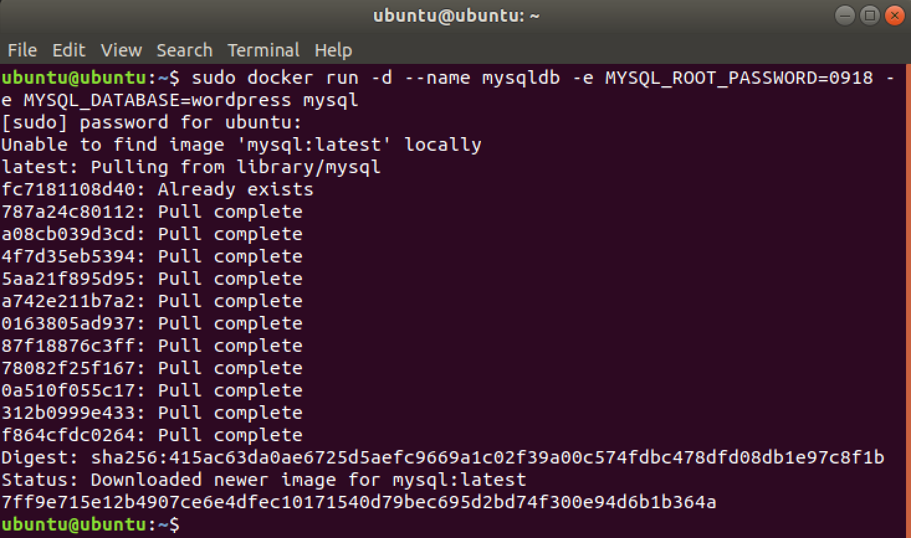

### MySQL 접속

```bash
sudo docker exec -it 7ff /bin/bash

mysql -u root -p
```


database 생성해보기

```mysql
show databases;

use wordpress

CREATE TABLE ganzik (ganzik_no INT(11) unsigned NOT NULL, ganzik_name VARCHAR(32) NOT NULL, PRIMARY KEY (ganzik_no));

show tables;
```

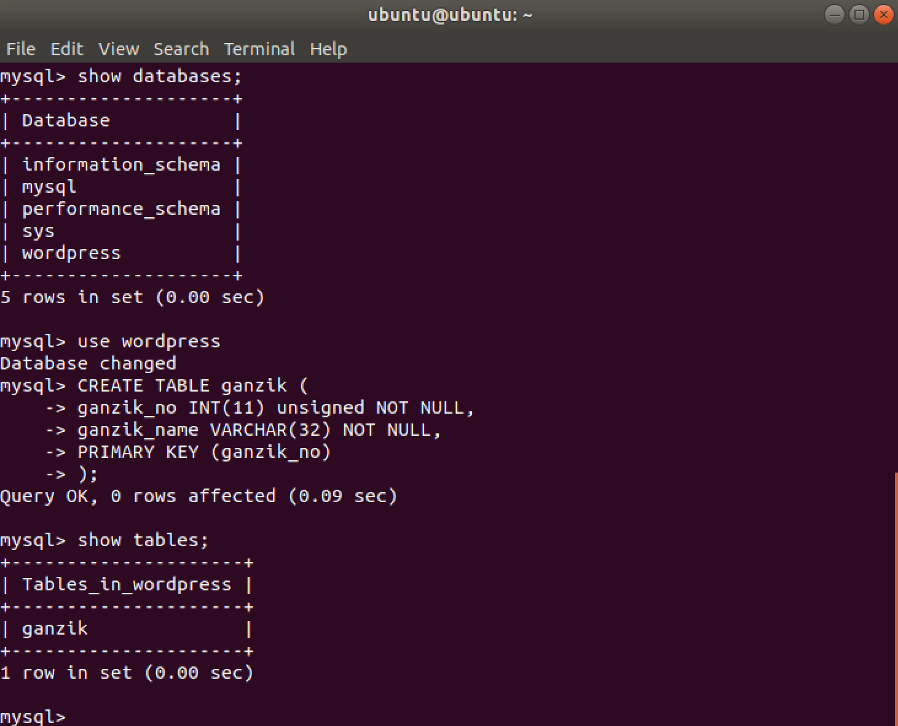

---

## MongoDB 서버 설치

### Mongodb 컨테이너 실행

```bash
sudo docker run --name my-mongo -d mongo:4-xenial
```


### mongodb 테스트

```bash
sudo docker exec -it my-mongo /bin/bash

# mongoDB 실행
mongo
```

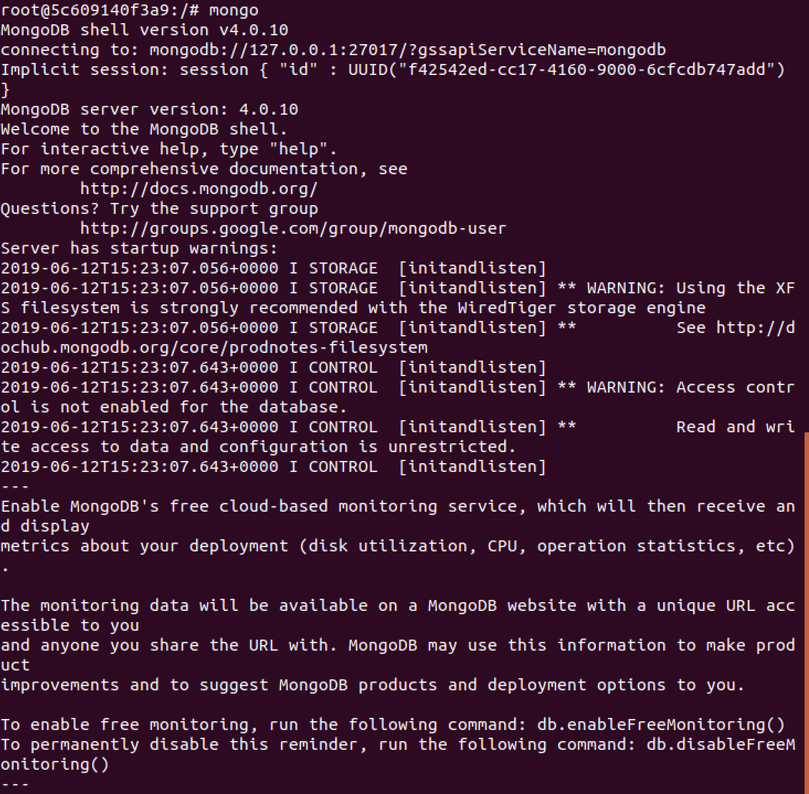

```bash
# 데이터베이스 확인한다
show dbs;

# mydb를 이용한다. 없으면 mydb를 생성
use mydb

# movie 컬렉션을 작성한다
db.movie.insert({"name":"avengers", "character":"iron man"});

# 생성된 컬렉션을 확인한다
show collections

# 데이터베이스에서 빠져 나간다
exit
```


---

## couchbase 생성

<https://hub.docker.com/_/couchbase>

```bash
# 이름이 couch인 couchbase 이미지를 이용한 컨테이너를 생성한다.
sudo docker run -d --name couch -p 8091-8094:8091-8094 -p 11210:11210 couchbase
```

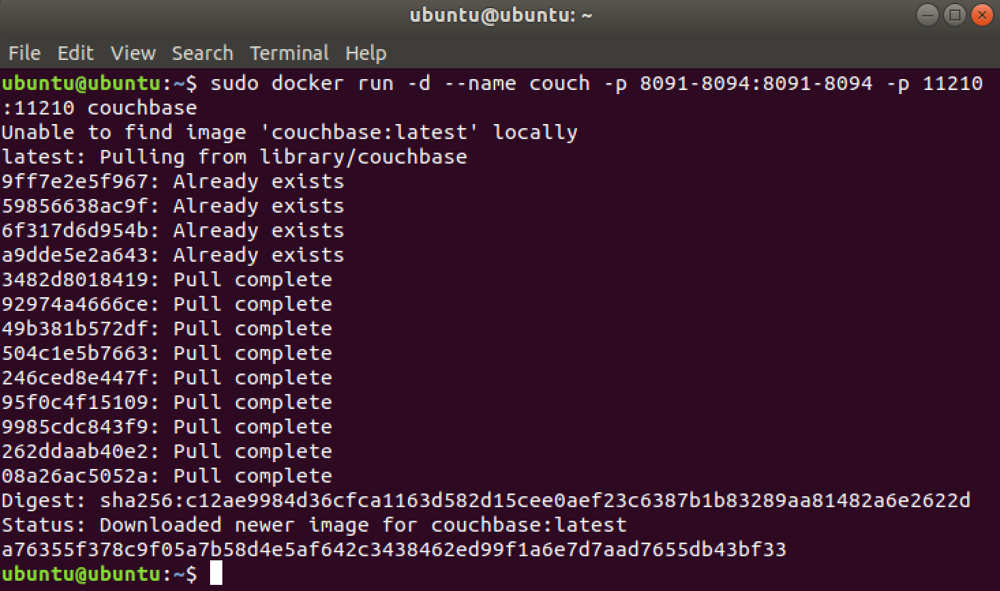

### 접속 확인

브라우저에서 `http://localhost:8091` 접속
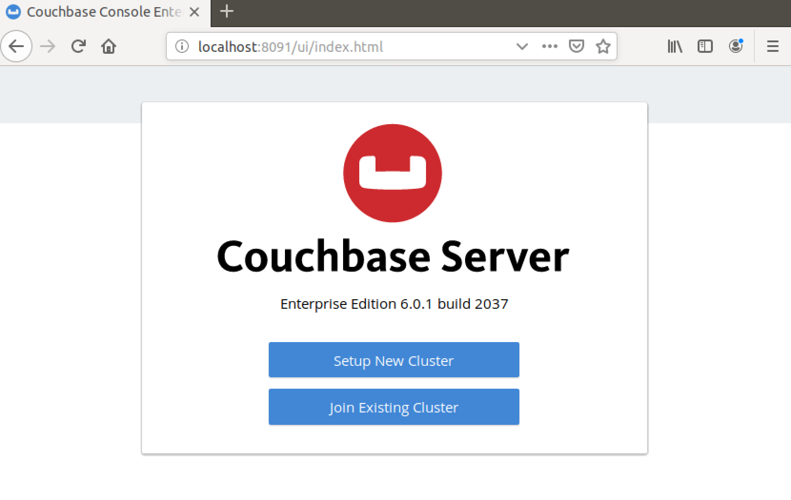
