# geth

<https://www.etherstudy.net/geth.html>

# 설치

<https://geth.ethereum.org/>

install ubuntu
<https://geth.ethereum.org/install-and-build/Installing-Geth#install-on-ubuntu-via-ppas>

```bash
sudo add-apt-repository -y ppa:ethereum/ethereum

sudo apt-get update
sudo apt-get install ethereum
```

## 버전 확인

```bash
geth version

```

## 데이터 디렉토리 생성

- 송수신하는 블록 데이터와 계정 정보를 저장하는 디렉토리

```bash
mkdir testnet

cd testnet
```

## genesis 블록 생성

```bash
# genesis.json 파일 생성
sudo vim genesis.json
```

```json
// testnet/genesis.json

{
  "config": {
    "chainId": 15,
    "homesteadBlock": 0,
    "eip155Block": 0,
    "eip158Block": 0
  },
  "nonce": "0x0000000000000042",
  "timestamp": "0x00",
  "parentHash": "0x0000000000000000000000000000000000000000000000000000000000000000",
  "extraData": "0x00",
  "gasLimit": "0x80000000",
  "difficulty": "0x4000",
  "mixHash": "0x0000000000000000000000000000000000000000000000000000000000000000",
  "coinbase": "0x3333333333333333333333333333333333333333",
  "alloc": {}
}
```

## geth 초기화

- genesis.json 파일 정보를 바탕으로 genesis 블록을 생성

```bash
geth --datadir ~/geth/testnet init ~/geth/testnet/genesis.json
```

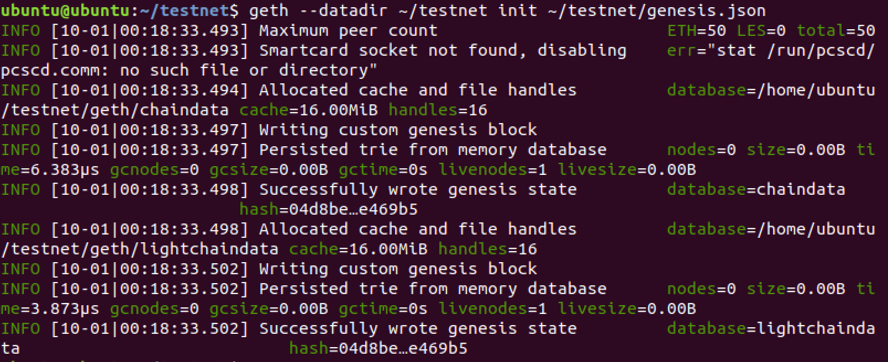


## geth 실행

```bash
# console > 자바스크립트 콘솔을 실행
# --networkid > 네트워크에서 해당하는 노드들을 식별하기 위한 아이디
# --nodiscover > 개발 목적으로 프라이빗하게 사용 할 것이다. 외부에서 네트워크를 찾지 못한다.
# --maxpeers > 나와 네트워크 구성 할 피어의 수
geth --datadir ~/geth/testnet console --networkid 4649 --nodiscover --maxpeers 0
```


ancient 디렉토리 -> 성능 향상을 위해 빠른 스토리지에 데이터를 나눠 저장 할 수 있도록 ssd와 hdd에 디렉토리를 나눌 수 있다. 디폴트값은 chaindata 아래에 생성된다.

Ethash -> asic 장비를 통한 채굴 독점을 막기 위해 DAGs을 사용하기 위해 데이터를 저장하는 디렉토리. 메모리를 일정수준 점유하게끔 만든다.

IPC > inter process call / 상반되는 개념은 RPC

## 데이터 디렉토리 확인

```bash
ubuntu@ubuntu:~/testnet$ tree
.
├── genesis.json
├── geth
│   ├── chaindata
│   │   ├── 000002.ldb
│   │   ├── 000003.log
│   │   ├── ancient # ssd와 같은 빠른 처리 디스크로 지정할 수 있다.
│   │   │   ├── bodies.0000.cdat
│   │   │   ├── bodies.cidx
│   │   │   ├── diffs.0000.rdat
│   │   │   ├── diffs.ridx
│   │   │   ├── FLOCK
│   │   │   ├── hashes.0000.rdat
│   │   │   ├── hashes.ridx
│   │   │   ├── headers.0000.cdat
│   │   │   ├── headers.cidx
│   │   │   ├── receipts.0000.cdat
│   │   │   └── receipts.cidx
│   │   ├── CURRENT
│   │   ├── CURRENT.bak
│   │   ├── LOCK
│   │   ├── LOG
│   │   └── MANIFEST-000004
│   ├── lightchaindata
│   │   ├── 000001.log
│   │   ├── CURRENT
│   │   ├── LOCK
│   │   ├── LOG
│   │   └── MANIFEST-000000
│   ├── LOCK
│   ├── nodekey
│   ├── nodes
│   │   ├── 000001.log
│   │   ├── CURRENT
│   │   ├── LOCK
│   │   ├── LOG
│   │   └── MANIFEST-000000
│   └── transactions.rlp
├── history # 커멘트 입력된 기록
└── keystore # 계정

6 directories, 33 files
```

## IPC 프로토콜로 연결

```bash
# 터미널 1 (서비스 및 데몬용)
geth --datadir ~/geth/testnet console --networkid 4649 --nodiscover --maxpeers 0

# 터미널 2
geth attach ipc:/users/kimkihong/geth/testnet/geth.ipc
# 지금 실행되고 있는 geth에 IPC로 붙는다.
```


## 사용법 확인

```bash
geth help
```

## 계정 생성

geth console에서 EOA계정을 생성 후 확인

```bash
personal.newAccount('pass0')  # pass0 라는 패스워드를 사용하는 계정을 생성

eth.accounts
```


- 개인키가 저장된 파일 위치를 볼 수 있다.

```bash
cd ~/geth/testnet/keystore

cat ./UTC--2019-10-01T08-16-32.585512482Z--99e1ca7be51f304b4d61ebab94569f77b80856f9
```


```bash
# 계정을 하나 더 생성한다.
personal.newAccount('pass1')

# 생성된 계정 확인
eth.accounts

# 첫번째 계정만 확인
eth.accounts[0]
```

## 콘솔이 아닌 geth 명령으로 계정 생성 및 확인

```bash
geth --datadir ~/geth/testnet account new
```


```bash
geth --datadir ~/geth/testnet account list
```

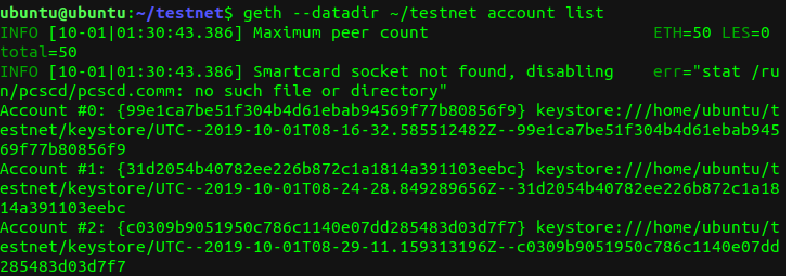

## 코인베이스 계정 확인 및 변환

```bash
# coinbase 계정 확인
eth.coinbase # 첫번째 만든 계정

# 두번째 계정을 코인베이스로 설정하기
miner.setEtherbase(eth.accounts[1])

# 두번째 계정이 coinbase로 설정된 것을 알 수 있다.
eth.coinbase

# 다시 첫번째로 coinbase로 설정 (주소를 직접 입력하기)
miner.setEtherbase('0x99e1ca7be51f304b4d61ebab94569f77b80856f9')
```

## 잔고 확인

```bash
# 코인베이스 계정 잔고 확인
eth.getBalance(eth.accounts[0])
eth.getBalance(eth.coinbase)

# 잔고는 모두 0으로 뜬다. 왜냐하면 아직 마이닝 전이기 때문에
```

## 포트 충돌이 일어나는 경우

터미널을 2개 열어 geth를 모두 실행시키면 나중에 실행한 터미널에서 오류를 아래와 같이 나타낸다

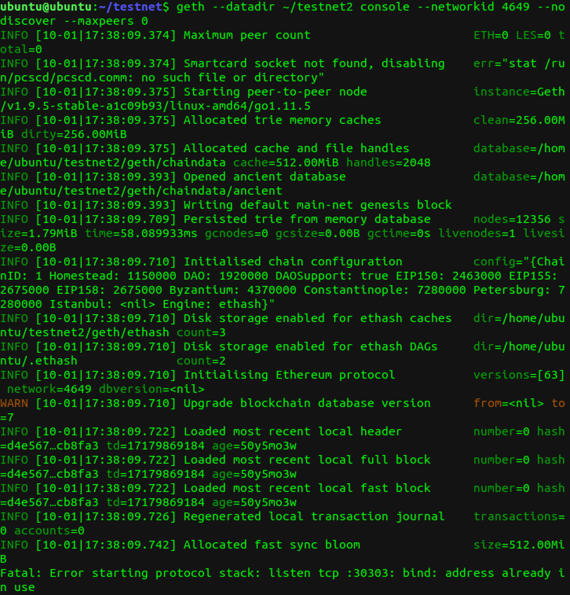

해결방법은 geth 실행 명령 할 때 --port 옵션을 준다.

```bash
 geth --datadir ~/testnet2 console --networkid 4649 --nodiscover --maxpeers 0 --port [다른 포트 번호]

```

## 블록 데이터가 깨져서 실행이 되지 않을 경우

이전 데이터를 삭제하고 초기화 한다.

윈도우일 경우

```
C:\Users\PC_USER_NAME\AppData\Ethash\ 폴더를 삭제
C:\Users\PC_USER_NAME\AppData\Roaming\Ethereum\ 폴더를 삭제
* PC_USER_NAME : 명령 프롬프트(cmd.exe)를 실행했을 때 나오는 이름
  예) C:\Users\myanj>
```

## 마이닝(채굴)하기

```bash
# 블록 넘버 확인
eth.blockNumber # 채굴 전이라 블록넘버는 0이다.

# 마이닝하기
miner.start(1) # 스레드 1개만 사용하여 마이닝을 한다.
```

마이닝 시작.
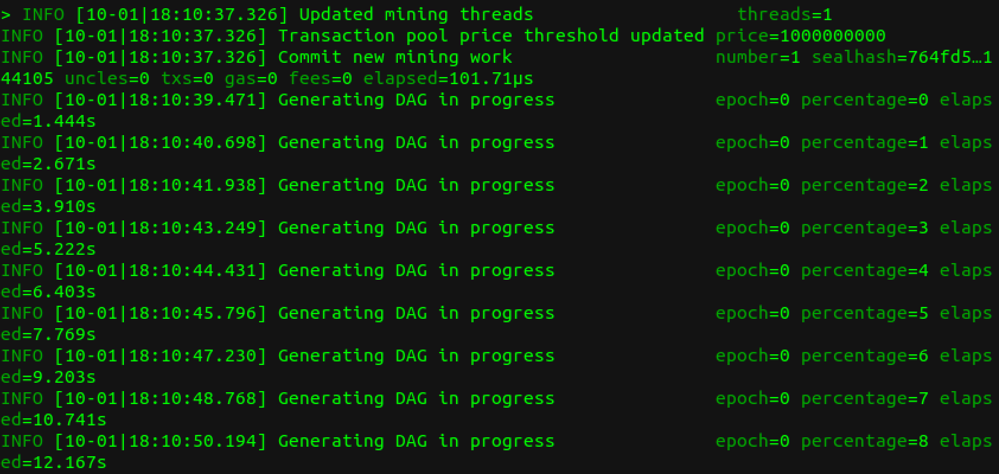
DAGs를 생성한다. percentage가 100까지 올라가야 마이닝을 시작한다.


```bash
# 마이닝 확인
eth.mining # true라고 떨어지면 정상적으로 마이닝 중이다.

# 해시래이트 확인
eth.hashrate # 해시래이트 값은 가변적이다.
```


블록이 생성되었다.

```bash
# 블록 넘버 확인
eth.blockNumber

# 코인베이스 잔고 확인
eth.getBalance(eth.coinbase) # 블록이 생성되면서 코인베이스에 잔고가 들어온 것을 확인 할 수 있다.

# wei 단위를 ether 단위로 환산해서 출력
web3.fromWei(eth.getBalance(eth.coinbase), "ether")

# 채굴 보상은 5eth
```

## 이더 송금하기

보내는 사람(첫번째 계정인 코인베이스)과 받는 사람(두번째 계정)의 잔고를 확인

```bash

web3.fromWei(eth.getBalance(eth.accounts[0]), "ether")

web3.fromWei(eth.getBalance(eth.accounts[1]), "ether")
```

첫번째 계정에서 두번째 계정으로 10이더를 송금

```bash
eth.sendTransaction({from: eth.accounts[0], to: eth.accounts[1], value: web3.toWei(10, "ether")})

```


보내는 사람 계정 잠금을 해제 해야 송금 가능하다.

```bash
# 첫번째 계정 잠금을 해제한다. 아래 명령어 입력 후 첫번째 계정 패스워드를 입력
personal.unlockAccount(eth.accounts[0])

# 두번째 인자 값으로 패스워드를 넣을 수도 있다.
personal.unlockAccount(eth.accounts[0], "pass0")
```

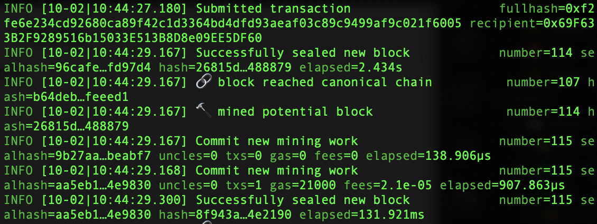


트랜젝션이 발생하고 블록생성이 되면 전송수수료인 가스도 포함되는 것을 알 수 있다.

```bash
# 이더를 송금받은 두번째 주소 계좌를 조회하면 10이더가 들어 온 것을 확인 할 수 있다.
web3.fromWei(eth.getBalance(eth.accounts[1]), "ether")
```

```bash
# pending 트랜젝션 확인 - 블록에 들어가지 못한 상태의 트랜젝션
eth.pendingTransactions
```

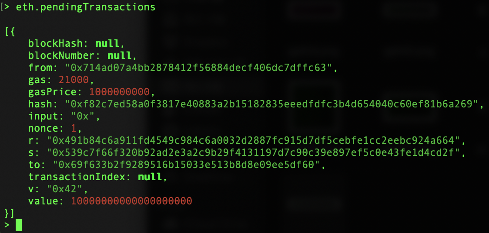

```bash
# 트랜젝션 확인
eth.getTransaction("0xf82c7ed58a0f3817e40883a2b15182835eeedfdfc3b4d654040c60ef81b6a269")

eth.getTransaction(eth.pendingTransaction[0].hash)
```

```bash
# 블록 생성하여 트랜젝션을 블록에 담고 채굴 중지하기
miner.start(1)
miner.stop()

# pending 트랜젝션 확인하면 비어있다. 마이닝을 통해 블록에 기록되었기 때문이다.
eth.pendingTransactions

# 트랜젝션을 확인한다. - 펜딩 되어있을때와 다르게 블록넘버와 블록해시값이 들어가있다.
eth.getTransaction("0xf82c7ed58a0f3817e40883a2b15182835eeedfdfc3b4d654040c60ef81b6a269")
```

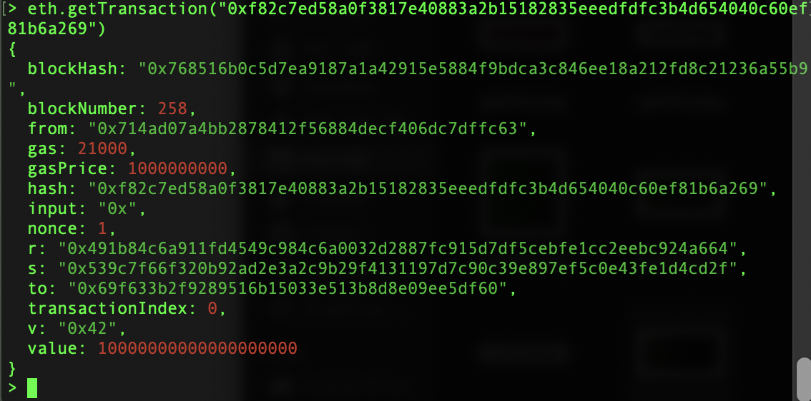

## 블록 정보를 조회

```bash
eth.getBlock(258)
```

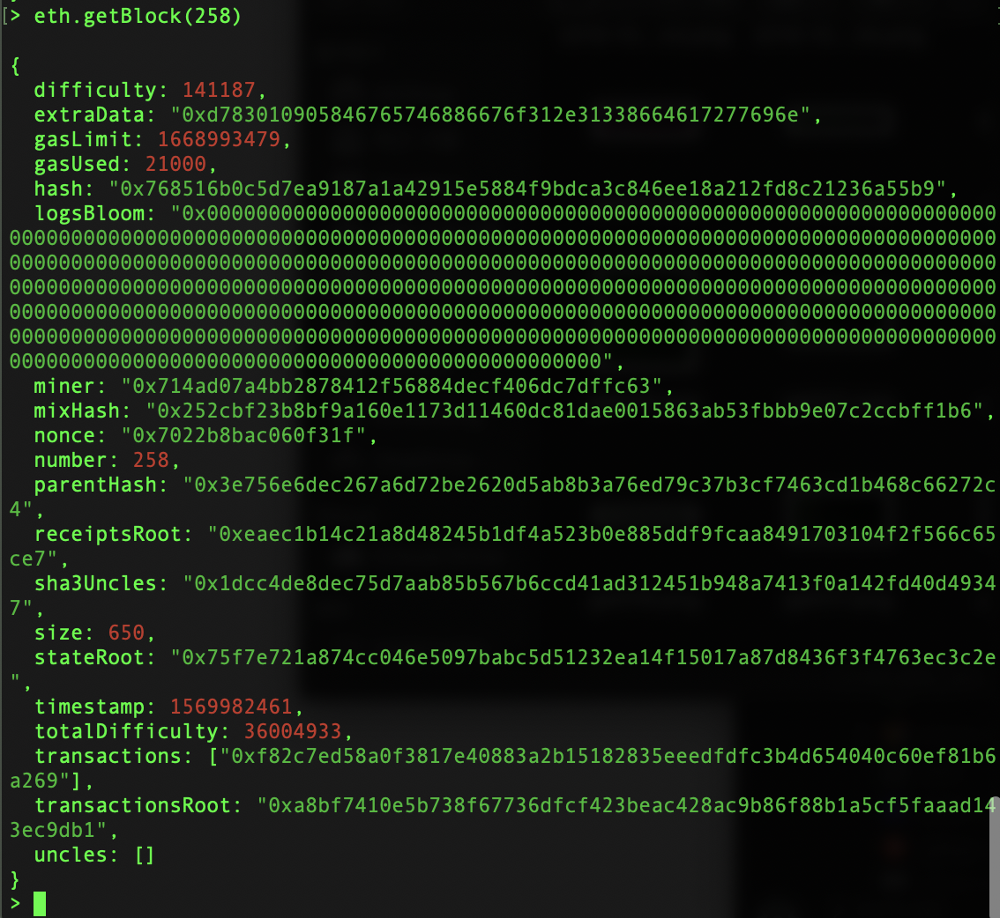

## 영수증 확인

```bash
eth.getTransactionReceipt("0xf82c7ed58a0f3817e40883a2b15182835eeedfdfc3b4d654040c60ef81b6a269")


```

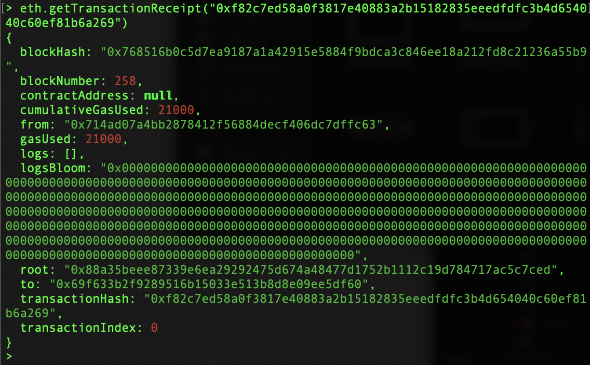

지금까지는 코인베이스 계정과 마이너 계정이 같기 때문에 송금 수수료를 다시 마이닝 보상으로 들어왔다. 수수료가 발생하는 거래를 위해 코인베이스가 아닌 계좌로 송금을 해보자.

## 수수료가 발생하는 거래

두번째 계정에서 세번째 계정으로 10eth 송금 - 두번째 계정 계좌 잠금 해제

마이닝 (트랜젝션이 포함된 것을 확인 후 마이닝 중지)

생성된 블록의 개수를 확인

첫번째, 두번째, 세번째 계정의 잔액을 조회

```bash
personal.unlockAccount(eth.accounts[1], "pass1")

eth.sendTransaction({from: eth.accounts[1], to: eth.accounts[2], value: web3.toWei(10, "ether")})

miner.start(1)

miner.stop()

web3.fromWei(eth.getBalance(eth.accounts[0]), "ether")
web3.fromWei(eth.getBalance(eth.accounts[1]), "ether")
web3.fromWei(eth.getBalance(eth.accounts[2]), "ether")
```


```bash
# 송금 트랜젝션 환인
eth.getTransaction("0x386fb81e31ecd30b42bb907fe809112e4d9566556ba225c2eeb682c4271a950a")
```

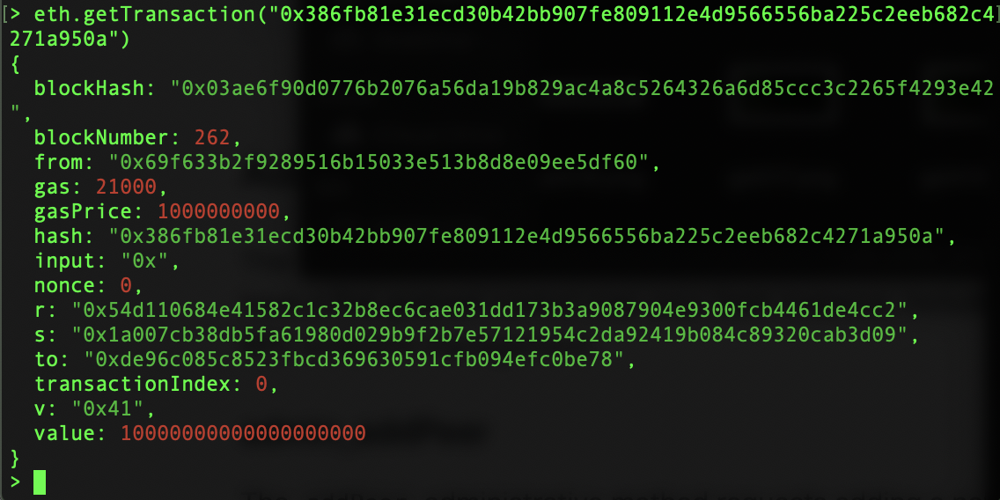

트랜젝션이 262번째 블록에 담겼다.

위 결과를 통해 두번째 계정에서 세번째 계정으로 송금 할 때 발생한 수수료는 채굴자인 코인베이스 계정으로 들어간 것을 확인 할 수 있다.

```bash
# 사용된 가스 gasUsed
gasUsed = eth.getTransactionReceipt(eth.getBlock(262).transactions[0]).gasUsed

# 가스프라이스 gasPrice
gasPrice = eth.getTransaction(eth.getBlock(262).transactions[0]).gasPrice

txFee = gasUsed * gasPrice

web3.fromWei(txFee, "ether")
```


---

## RPC로 geth 구동

geth 구동시 http기반의 Json-RPC 서비스를 활성화

```bash
geth --datadir ~/geth/testnet console --networkid 4649 --nodiscover --maxpeers 0 --rpcaddr "0.0.0.0" --rpcport 8545 --rpccorsdomain "*" --rpc --rpcapi "db,eth,net,web3,admin,debug,miner,shh,txpool,personal"

# domain을 변경하면 다른 피어로 붙을 수 있다.
geth attach rpc:http://localhost:8545
```

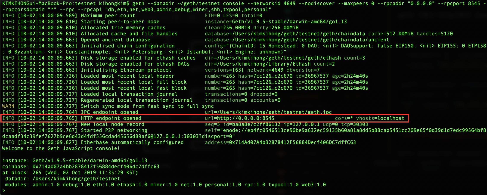

## postman으로 rpc 통신 테스트

<https://github.com/ethereum/wiki/wiki/JSON-RPC>

jrpc로 새로운 지갑 생성

```json
{
  "jsonrpc": "2.0",
  "method": "personal_newAccount",
  "params": ["pass3"],
  "id": 10
}
```

jsonrpc 버전은 2.0으로 통신하고 geth 메소드는 `personal.newAccount -> personal_newAccount`, params 파라메타는 인자값인 패스워드 값, id는 동시 다발적으로 통신해서 리턴되는 값들을 구분하기 위해 입력
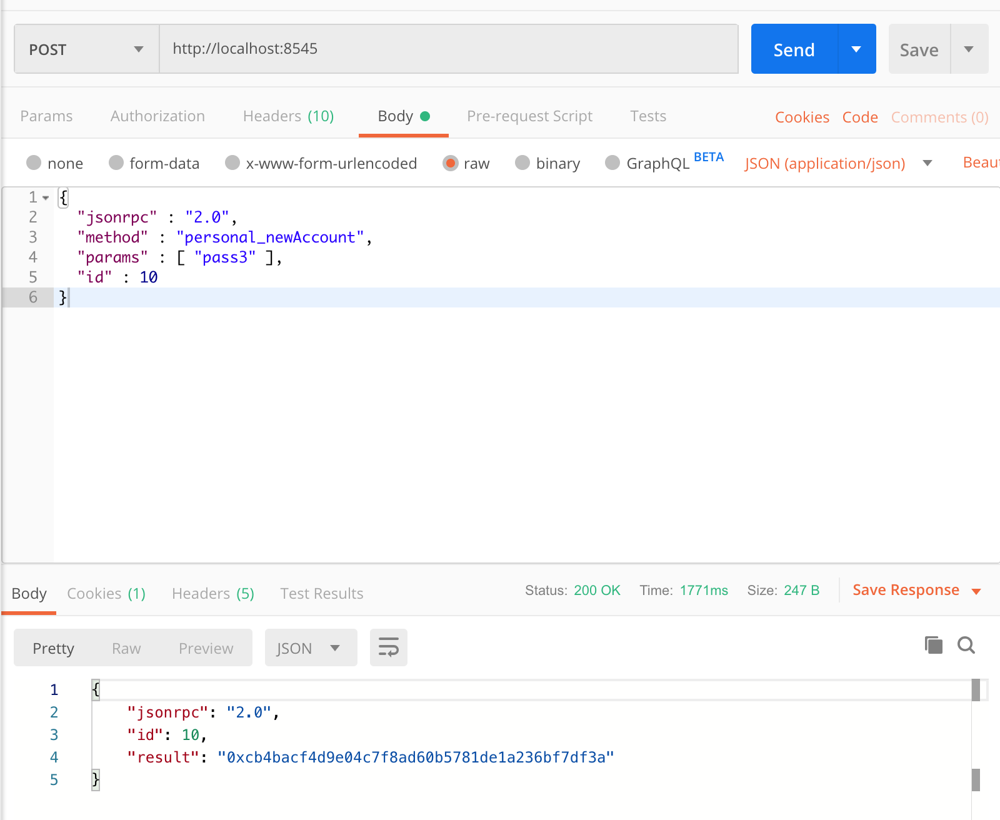

```bash
# geth 콘솔에서 accounts를 확인하면 지갑이 생성된 것을 알 수 있다.
eth.accounts
```

## postman을 이용하여 현재 계정 목록 조회하기

```json
{
  "jsonrpc": "2.0",
  "method": "eth_accounts",
  "params": [],
  "id": 1
}
```

or

```bash
{
  "jsonrpc" : "2.0",
  "method" : "personal_listAccounts",
  "params" : [],
  "id" : 1
}
```

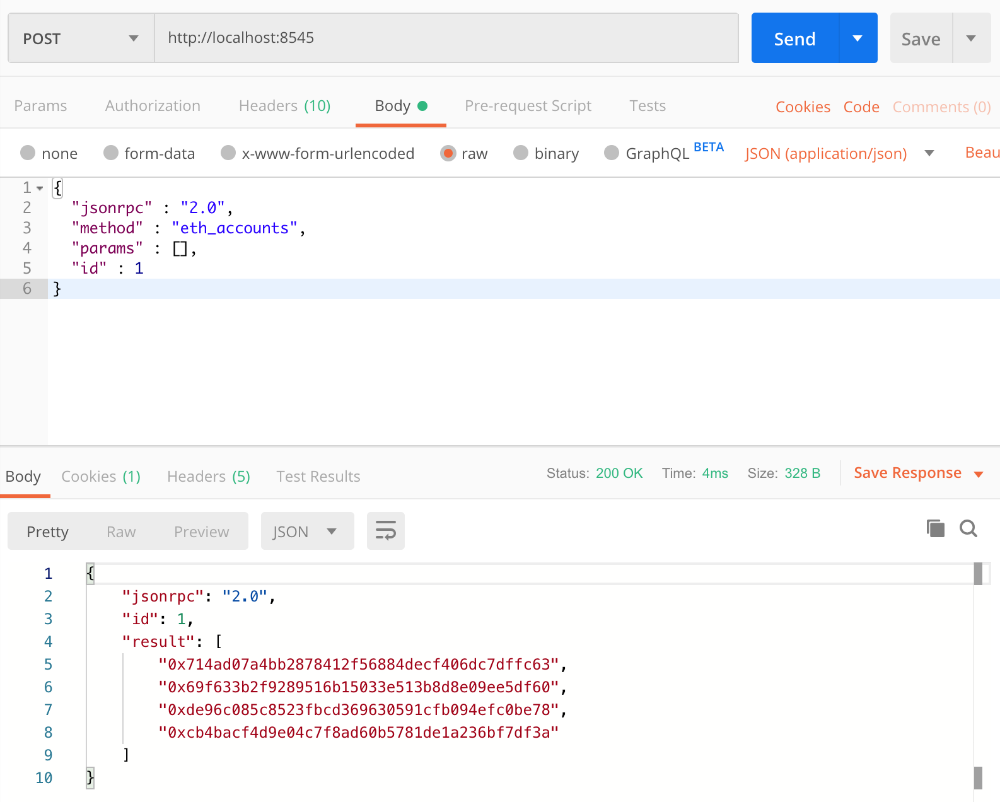

### 채굴 여부 조회

```json
{
  "jsonrpc": "2.0",
  "method": "eth_mining",
  "params": [],
  "id": 1
}
```

### 해쉬래이트 조회

```json
{
  "jsonrpc": "2.0",
  "method": "eth_hashrate",
  "params": [],
  "id": 1
}
```

### 블록 길이(높이) 조회

```json
{
  "jsonrpc": "2.0",
  "method": "eth_blockNumber",
  "params": [],
  "id": 1
}
```

### 세번째 계정 (accounts[2]) 잔액 조회

```json
{
  "jsonrpc": "2.0",
  "method": "eth_getBalance",
  "params": ["0xde96c085c8523fbcd369630591cfb094efc0be78", "latest"],
  "id": 1
}
```

### 세번째 계정에서 네번째 계정으로 0.3이더 송금

3번째 계정 잠금 해제

```json
{
  "jsonrpc": "2.0",
  "method": "personal_unlockAccount",
  "params": ["0xde96c085c8523fbcd369630591cfb094efc0be78", "pass2", 300],
  "id": 1
}
```

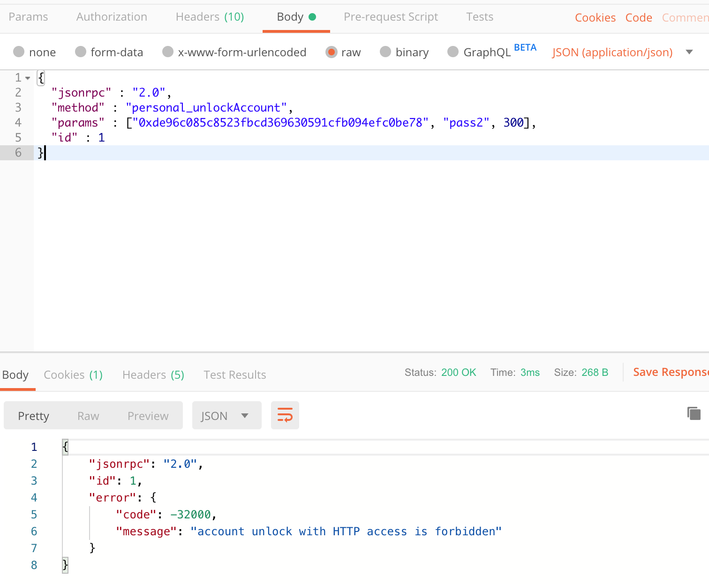

에러. geth 실행시 명령 옵션을 추가해준다.

```bash
geth --datadir ~/geth/testnet console --networkid 4649 --nodiscover --maxpeers 0 --rpcaddr "0.0.0.0" --rpcport 8545 --rpccorsdomain "*" --rpc --rpcapi "db,eth,net,web3,admin,debug,miner,shh,txpool,personal" --allow-insecure-unlock
```

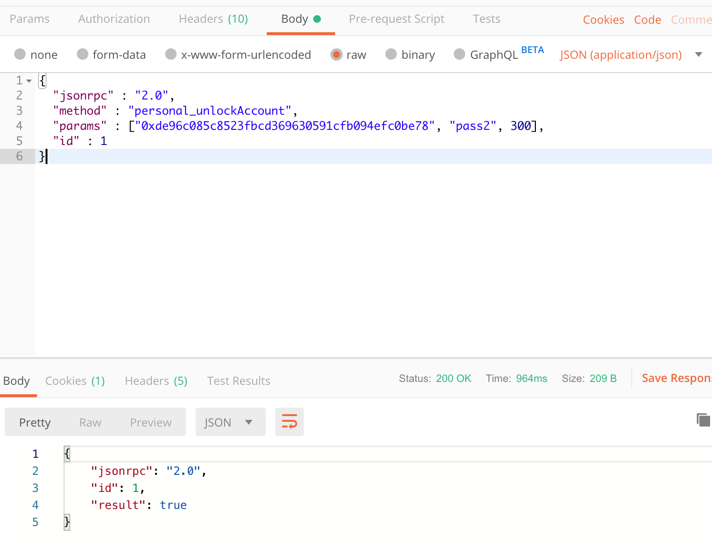

```json
{
  "jsonrpc": "2.0",
  "method": "eth_sendTransaction",
  "params": [
    {
      "from": "0xde96c085c8523fbcd369630591cfb094efc0be78",
      "to": "0xcb4bacf4d9e04c7f8ad60b5781de1a236bf7df3a",
      "gas": "0x76c0",
      "gasPrice": "0x9184e72a000",
      "value": "0x429d069189e0000"
    }
  ],
  "id": 1
}
```

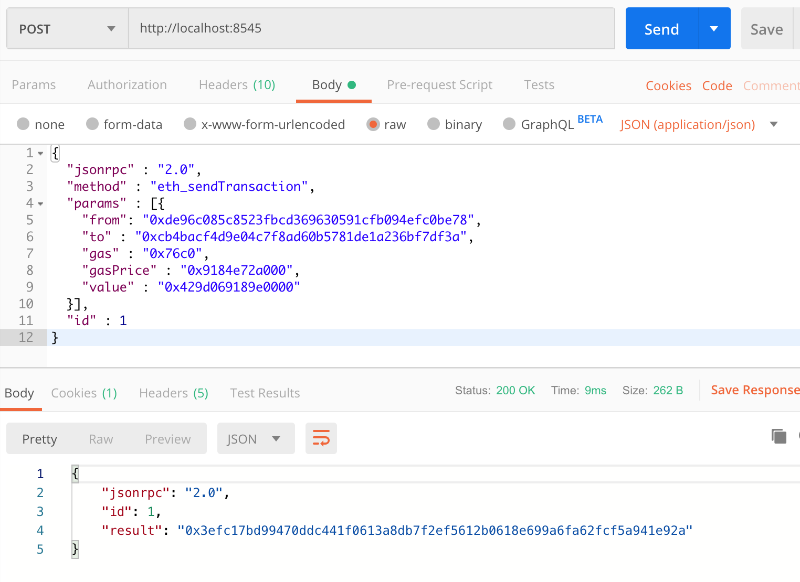

### 세번째 계좌 조회

```json
{
  "jsonrpc": "2.0",
  "method": "eth_getBalance",
  "params": ["0xde96c085c8523fbcd369630591cfb094efc0be78", "latest"],
  "id": 1
}
```

### 네번째 계좌 조회

```json
{
  "jsonrpc": "2.0",
  "method": "eth_getBalance",
  "params": ["0xcb4bacf4d9e04c7f8ad60b5781de1a236bf7df3a", "latest"],
  "id": 1
}
```
