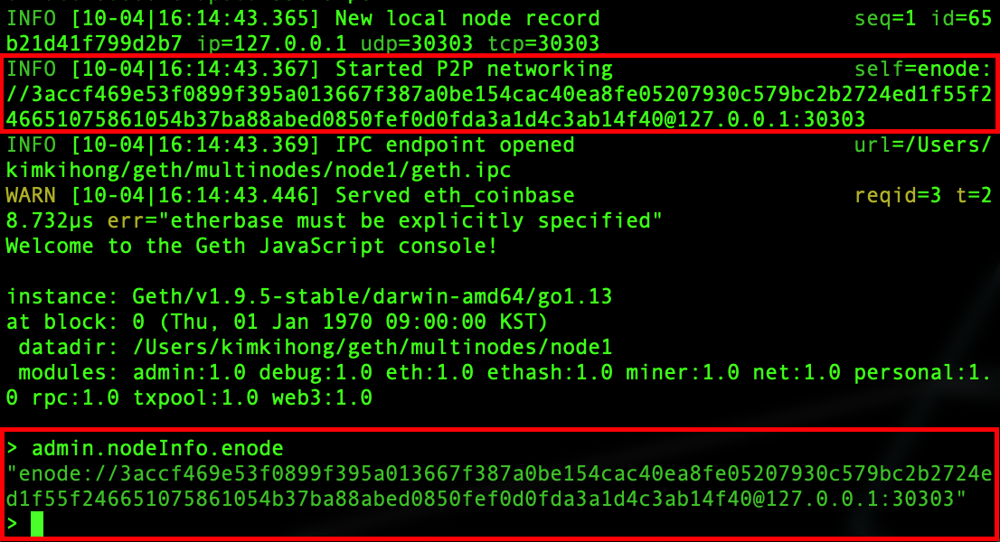

# 단일 머신에 여러 노드(geth) 띄우기

```bash
mkdir multinodes

cd multinodes

mkdir node1
mkdir node2
mkdir node3
```

### 동일한 genesis.json 파일을 이용해서 geth 초기화

```bash
geth --datadir ~/geth/multinodes/node1 init ~/geth/testnet/genesis.json

geth --datadir ~/geth/multinodes/node2 init ~/geth/testnet/genesis.json

geth --datadir ~/geth/multinodes/node3 init ~/geth/testnet/genesis.json

```

### 터미널을 세 개 띄워서 geth 노드 구동

```bash
# 터미널 1
cd geth/multinodes/node1

# 터미널 2
cd geth/multinodes/node2

# 터미널 3
cd geth/multinodes/node3
```

### 첫번째 노드는 부트 노드로 활용

부트 노드는 피어들을 관리해주는 역할

```bash
# 노드1 (터미널 1)
geth --datadir ~/geth/multinodes/node1 --networkid 4649 console

# 부트노드의 주소(enode)를 확인
admin.nodeInfo.enode
```



### 두번째 노드는 일반 노드로 활용

```bash
# 노드2 (터미널 2)
geth --datadir ~/geth/multinodes/node2 --networkid 4649 console --port 30304 --ipcdisable

# 부트노드에 피어로 등록

```
