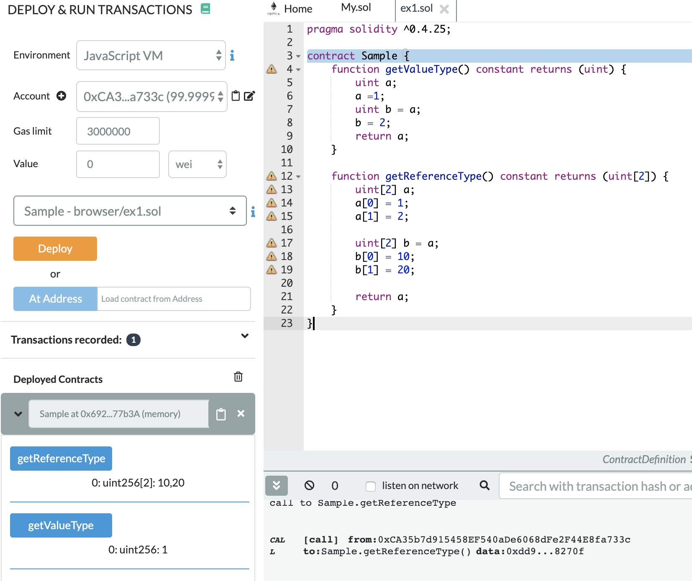

# 이건 뭐지

```js
pragma solidity >=0.4.25 <0.6.0 ;

contract Sample {
	function getValueType() public pure returns (uint) {
		uint a;
		a = 1;
		uint b = a;
		b = 2;
		return a;	// 1
	}

	function getReferenceType() public pure returns (uint[2] memory) {
		uint[2] memory a;
		a[0] = 1;
		a[1] = 2;

		uint[2] memory b = a;
		b[0] = 10;
		b[1] = 20;

		return a;	// 10, 20
	}
}
```



## 정수형(int, uint)

```js
pragma solidity >=0.4.25 <0.6.0;

contract Sample {
    function div() public pure returns (uint) {
        uint a = 3;
        uint b = 2;
        uint c = a / b * 10;
        return c; // 0: uint256: 10
    }

    function divLiteral() public pure returns (uint) {
        uint c = 3 / 2 * 10;
        return c; // 0: uint256: 15
    }

    function divByZero() public pure returns (uint) {
        uint a = 3;
        uint b = 3 / 0; // TypeError: Operator / not compatible with types int_const 3 and int_const 0
        uint c = a / 0; // TypeError: Division by zero.
        return c;
    }

    function shift() public pure returns (uint[2] memory) {
        uint[2] memory a;
        a[0] = 16 << 2; // 16 * 2^2
        a[1] = 16 >> 2; // 16 / 2^2
        return a;
    }
}
```

## 불린형(bool)

true, false를 값으로 가지는 타입  
정수형으로 변환되지 않음

```js
pragma solidity >=0.4.25 <0.6.0;

contract Sample {
	function getTrueAndFalse() public pure returns (bool) {
		bool a = true;
		bool b = false;
		return a && b;		// false
	}

	function getTrueOrFalse() public pure returns (bool) {
		bool a = true;
		bool b = false;
		return a || b;		// true
	}
}
```

## 바이트 배열

bytes1, bytes2, bytes3, …, bytes32 ⇒ 값 타입의 바이트 배열  
bytes => 참조 타입의 동적 크기 바이트 배열  
string => 참조 타입의 동적 크기의 utf-8 인코딩된 문자열

```js
pragma solidity >=0.4.25 <0.6.0;

contract Sample {
	function getByte2() public pure returns (bytes2) {
		bytes2 b2 = "bb";
		return b2;	// 0x6262
	}

	function getBytes() public pure returns (bytes memory) {
		bytes memory bs = "babababa";
		return bs;	// 0x6261626162616261
	}

	function getString() public pure returns (string memory) {
		string memory s = "babababa";
		return s;	// babababa
	}
}
```

## 배열

고정길이 배열 ⇒ datatype[arraysize] variable;  
가변길이 배열 ⇒ datatype[] variable;  
array.length ⇒ 배열 길이 속성으로 가변길이 배열에서는 이 값을 변경하여 배열의 길이를 변경할 수 있음  
array.push(x) ⇒ 가변길이 배열의 가장 뒤에 요소를 추가하는 메소드로 새로운 배열의 길이를 반환

### 변수의 종류별 기본 저장위치

스토리지(storage) : 상태 변수, 함수 내 로컬 변수  
메모리(memory) : 함수의 매개 변수, 함수의 리턴값  
배열, 구조체와 같은 복합 데이터는 지시어를 사용하여 저장 위치 지정이 가능

```js
pragma solidity >=0.4.25 <0.6.0;

contract Sample {

	    // 구조체 정의 방법
    struct Customer{
        string name;
        uint age;
        bool isMarried;
        uint[] bankAccounts;
    }

    // 구조체 인스턴스 생성
    Customer c1 = Customer("kihong", 37, true, new uint[](3));
    Customer c2 = Customer({name:"yujun", age: 4, isMarried: false, bankAccounts: new uint[](1)});


    uint[5] public farray = [ uint(10), 20, 30, 40, 50];
    uint[] public darray;

    function getFarray() public returns (uint[5] memory) {
        uint[5] storage a = farray;
        return a; // [10,20,30,40,50]를 출력
    }

    function getFarray2() public returns (uint[5] memory) {
        uint[5] storage a = farray; // 상태변수와 동일한 주소를 공유
        for (uint i = 0; i < a.length; i ++) {
            a[i] = i + 1;
        }
        return a; // [1,2,3,4,5]를 출력
    }

    // function pushFarray(uint x) public view returns (uint) {
    //     farray.push(x); // 컴파일 에러 발생. 고정배열에 대해서는 push 할 수 없다.
    //     return farray.length;
    // }

    function pushDarray(uint x) public returns (uint) {
        return darray.push(x); // darray 길이를 반환
    }

    function getDarrayLength() public view returns (uint) {
        return darray.length;
    }

    function initDarray(uint len) public {
        darray.length = len;
        for (uint i = 0; i < len; i ++) {
            darray[i] = i + 1;
        }
    }

    function getDarray() public view returns (uint[] memory) {
        return darray;
    }

    function delDarray() public returns (uint) {
        delete darray;
        return darray.length;
    }

    function delFarray() public returns (uint) {
        delete farray; // 정적배열의 경우 delete하는 경우 배열의 수는 그대로 이고 값만 0으로 출력된다.
        return farray.length;
    }
}
```

## 구조체

사용자 정의 자료형  
복합 자료형으로 서로 다른 자료형으로 지정된 여러개의 변수로 구성  
구조체의 인스턴스를 생성할 때는 new 키워드를 사용하지 않음  
함수의 매개변수 및 반환 형식으로 사용할 수 없음

### 변수의 종류별 기본 저장위치

스토리지(storage) : 상태 변수, 함수 내 로컬 변수  
메모리(memory) : 함수의 매개 변수, 함수의 리턴값  
배열, 구조체와 같은 복합 데이터는 지시어를 사용하여 저장 위치 지정이 가능

## 열거형 (enum)

미리 이름이 붙여진 상수를이 나열된 목록  
열형 내의 상수 값은 명시적으로 정수로 변환 가능 (0부터 1씩 증가)  
열거형 끝에는 세미콜론이 없음  
중괄호 안에는 한 개 이상의 항목이 정의되어 있어야함

```js
// 열거형 선언
enum gender { male, female }

// 열거형 사용
gender mygender = gender.male;
```

```js
pragma solidity >=0.4.25 <0.6.0;
contract Enum {
    enum Colors { Red, Blue, Green }

    Colors color;
    Colors constant defaultColor = Colors.Green;

    function setBlue() public {
    	color = Colors.Blue;
    }

    function getColor() public view returns (Colors) {
    	return color;
    }

    function getDefaultColor() public pure returns (uint) {
    	return uint(defaultColor);
    }
}
```
