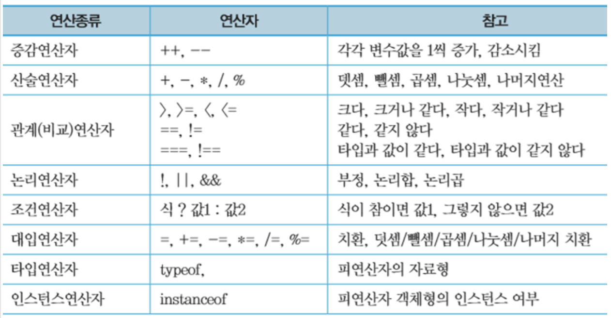
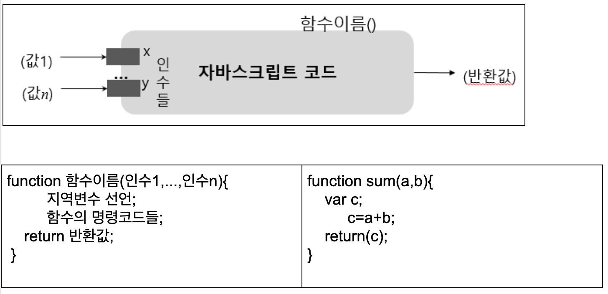

# JavaScript

스크립트형 언어는 함수를 기반으로 프로그램 시작과 끝이 있는것이 아닌 객체 하나에 대한 이벤트 처리만 가능하게 하는 언어

## JavaScript로 할 수 있는 것

- 웹 페이지 HTML 수정

```js
document.getElementById("target").innerHTML("<h1>바뀐 타이틀</h1>");
```

- 특정 HTML 태그의 속성값 변경

```js
document.getElementById("target").src = "new_image.jpg";
```

- 특정 HTML 태그의 스타일 변경

```js
document.getElementById("target").style.fontSize = "24px";
```

- 이벤트 처리 (마우스 클릭 이벤트 등)

```html
<button onclick="alert('버튼 눌러짐')">버튼</button>
```

## JavaScript 언어의 특징

- 인터프리터 언어
  > 인터프리터형 랭귀지(오류가 나면 멈춤)  
  > 컴파일러형 랭귀지(문법적인 오류가 없으면 실행파일 생성)
- 동적 타입 지원
- 객체 기반
- 함수형 프로그래밍 지원

## JavaScript 장점

- 서버 부하 감소: 클라이언트에서 JavaScript로 1차적인 입력 검사를 수행하면 불필요한 서버와의 통신을 줄일 수 있음
- 사용자 상호작용 향상: 사용자의 행동에 따라 즉각적인 반응을 서버 도움없이 처리 가능

## JavaScript 실행 흐름


## JavaScript 작성 위치

- \<script>태그 안에 작성
  - \<head>의 \<script> 태그
  - \<body>의 \<script> 태그
- inline 작성
  - 태그의 이벤트 속성 `(onclick="fun tion();")`
  - 링크 태그의 href속성 (`<a href="javascript.function()">함수실행</a>`)
- 외부 파일 작성
  - js/script.js 파일 작성 후 `<script src="js/script.js">`로 문서에 포함

## JavaScript로 출력하기

```js
console.log();

alert();

<button onclick="alert('버튼이 눌렸어요')">버튼</button>;
```

## JavaScript로 입력받기

```js
// prompt
var result = prompt("아이디를 입력하세요");
console.log(result);
document.write("입력하신 아이디는 " + result + " 입니댜");

//confirm
var result2 = confirm("회원 탈퇴를 하시겠습니까?");
document.write(result2);
```

## 기본 문법

### 변수 선언

- 변수는 변하는 데이터를 저장할 수 있는 메모리 공간(빈 상자)
- 변수 이름을 지을 때는 camelCase 방식 사용 권장
- 변수는 한번에 하나의 값만 저장할 수 있음(이전에 값이 있으면 덮어씀)
- 수치형, 문자열, 부울형, 객체형 등이 있음

기존에는 var를 이용하여 선언했지만 지금은
const, let 을 이용하여 변수를 선언한다.

let: 전역변수와 코드블록 안의 변수를 구분한다

#### typeof 변수의 속성을 나타낸다

```js
// number
var test = 1;
document.write(typeof test);

// string
var test = "1";
document.write(typeof test);

// boolean
var test = true;
document.write(typeof test);

// function
var test = function() {
  return 1;
};
document.write(typeof test);

// object
```

### 숫자형

```js
 <script>
        var x = 314e-2,
            y = 12345e10;
        var num1 = 999999999999999,
            num2 = 9999999999999999;
        document.write("x = " + x + "<br>");
        document.write("y =  " + y + "<br>");
        document.write("num1 =  " + (num1) + " <br> ");

        // 15자리 이상을 입력했을 때는 출력이 제대로 되지 않는다
        document.write("num2 =  " + (num2) + " <br> ");
        document.write("54 / 0  =  " + (54 / 0) + "<br> ");
        document.write("-54 / 0 = " + (-54 / 0) + " <br> ");

        // 숫자를 문자로 나눴을 때 NaN(Not a Number)을 출력한다
        document.write("88/’pi’ =  " + (88 / 'pi'));
    </script>
```

### boolean 형

- 참과 거짓을 저장 (true, false)
- 관계식이나 논리식으로 표현되고 조건문과 반복문에서 실행조건을 표현하는데 사용
- 0, -0, 공백문자열(""), undefind 변수, null 객체 : false
- 그 외의 값 : true

```js
<script>
   var state, num1=0, num2=88;
   var str1="";  str2="Javascript"
   var obj1 = null;
   var obj2 = new Object();

   document.write(Boolean(num1) + '<br>');
   document.write(Boolean(num2) + '<br>');
   document.write(Boolean(str1) + '<br>');
   document.write(Boolean(str2) + '<br>');
   document.write(Boolean(obj1) + '<br>');
   document.write(Boolean(obj2) + '<br>');
   document.write(Boolean(state) + '<br>');
</script>
```

### undefined 형

- 변수가 자료형을 결정할 수 없음을 나타내는 것
- 변수명 선언 후 아직 값을 저장하지 않았거나 변수값으로 undefined를 저장한 변수들
- undefined: 기본 자료형 변수가 비어있음을 나타냄
- null: 객체형 변수가 비어있음을 나타냄(자료형: object)

### typeof 연산자

- 인수의 자료형을 반환하는 연산자

```js
<script>
       document.write(typeof "John" + '<br>'); // 문자열
       document.write(typeof 3.14 + '<br>'); // 실수
       document.write(typeof NaN + '<br>'); // NaN
       document.write(typeof false + '<br>'); // 논리형
       document.write(typeof [1, 2, 3, 4] + '<br>'); // 배열
       document.write(typeof
           function () {} + '<br>'); // 함수
       document.write(typeof myCar + '<br>'); // 정의되지 않은 변수
       document.write(typeof null); // null
   </script>

```

### 형변환

- 특정 자료형의 값을 다른 자료형의 값으로 변환해서 나타내는 것
- 자동 형변환: 연산자들은 일정한 규칙을 가지고 자동으로 형 변환
- 명시적 형변환: 형변환 함수 이용


1. 자동 형변환  
   \-, \*, \/ 는 숫자로 형변환 시킨다

   ```js
   <script>
      document.write((7 + null) + '<br>');
      document.write(("7" + null) + '<br>');
      document.write(("7" + 2) + '<br>');
      document.write((2 + "7") + '<br>');
      document.write(("7" - 2) + '<br>');
      document.write((2 - "7") + '<br>');
      document.write(("7" * "2") + '<br>');
      document.write(("7" / "2") + '<br>');
      document.write(("abc" - 2) + '<br>');
      document.write(("abc" * 2) + '<br>');
      document.write(("abc" / 2) + '<br>');
   </script>
   ```

2. 강제 형변환

   ```js
    <script>
      var num1 = 3.145,
          num2 = 20,
          num3 = 100;
      var str1 = "58",
          str2 = "3.678",
          str3 = "javascript";
      var flag1 = true,
          flag2 = false;

      document.write(str1 + num2 + '<br>');
      document.write(Number(str1) + num2 + '<br>');
      document.write(parseInt(str1) + num2 + '<br>');
      document.write(parseInt(str2) + num2 + '<br>');
      document.write(parseInt(str3) + num2 + '<br>');
      document.write(parseFloat(str2) + num2 + '<br>');
      document.write(parseInt(num1) + num2 + '<br><hr>');
      document.write(num2 + num3 + '<br>');
      document.write(num2 + num3.toString() + '<br>');
      document.write(Boolean(num2) + num3.toString() + '<br>');
      document.write(str3 + Number(flag1) + '<br>');
      document.write(str3 + Number(flag2) + '<br>');
   </script>
   ```

## 연산자



### 산술 연산자

| Operator | Description                                |
| -------- | ------------------------------------------ |
| \+       | Addition                                   |
| \-       | Subtraction                                |
| \*       | Multiplication 곱하기                      |
| \*\*     | Exponentiation (거듭제곱)                  |
| \/       | Division 나누기                            |
| \%       | Modulus (Division Remainder) 나눗셈 나머지 |
| \++      | Increment                                  |
| \--      | Decrement                                  |

### 할당 연산자

| Operator | Example   | Same As      |
| -------- | --------- | ------------ |
| =        | x = y     | x = y        |
| +=       | x += y    | x = x + y    |
| -+       | x -= y    | x = x - y    |
| \*=      | x \*= y   | x = x \* y   |
| /=       | x /=      | x = x / y    |
| %=       | x %=      | x = x % y    |
| \*\*=    | x \*\*= y | x = x \*\* y |

### 비교 연산자

| Operator | Description                       |
| -------- | --------------------------------- |
| ==       | equal to                          |
| ===      | equal value and equal type        |
| !=       | not equal                         |
| !==      | not equal value or not equal type |
| >        | greater than                      |
| <        | less than                         |
| >=       | greater than or equal to          |
| <=       | less than or equal to             |
| ?        | ternary operator                  |
| A2       | B2                                |
| A3       | B3                                |

### 논리 연산자

| Operator | Description |
| -------- | ----------- |
| &&       | logical and |
| \|\|     | logical or  |
| !        | logical not |

## 함수

- 정 작업을 수행하도록 구현된 코드 블록
- 인수들을 통해 외부로 부터 자료값을 전달 받고
- 실행 결과 값을 반환할 수 있음
- 보통 사용 전에 미리 정의해야 함
- 함수로 만들어놓은 코드는 재사용 할 수 있음



- 함수 실행 시점
  - 이벤트가 발생했을 때
  - 다른 Javascript 코드에 의해 호출되었을 때
- 함수의 리턴값
  - 함수 실행 후 리턴 값은 호출자에게 반환됨

```js
<script>
 var x = myFunction(4, 3);
 document.getElementById("demo").innerHTML = x;

 function myFunction(a, b) {
   return a * b;

</script>
```

## 이벤트

- 웹 문서를 로드한 웹 브라우저에서 발생되는 어떤 동작이나 상태변화를 나타내는 것
- 웹 문서를 로드한 웹 브라우저에서 발생되는 어떤 동작이나 상태변화를 나타내는 것웹 - - - 브라우저에 로드된 HTML 문서 와 사용자 사이의 상호작용에 의해 발생함
- 사용자의 마우스 클릭, 입력, 타이머 등
- 이벤트가 발생 했을 때, 호출되는 JavaScript 실행문을 이벤트 핸들러라고 함


### 이밴트 등록

1. 요소 직접 등록 방식: 태그의 이벤트 속성에 직접 등록

```html
<button id="”btn”" onclick="”alert(‘이벤트가" 발생했습니다.’);”>버튼</button>
```

2. DOM 을 이용한 방식

```html
<button id="”btn”">버튼</button>
<script>
  document.getElementById(“btn”).onclick=function() {
      alert(‘이벤트가 발생했습니다.’);
</script>
```

### 이벤트 처리

- 이벤트 발생 -> (웹브라우저) -> 이벤트 처리함수(이벤트핸들러) 호출 & 실행 -> 이벤트 처리
- 이벤트 등록 : 이벤트와 이벤트핸들러를 연결하는 과정
- 이벤트 속성 : 이벤트가 발생하면 설정된 자바스크립트 코드를 실행하는 속성
  - 속성이름은 “on이벤트명” 형식임
