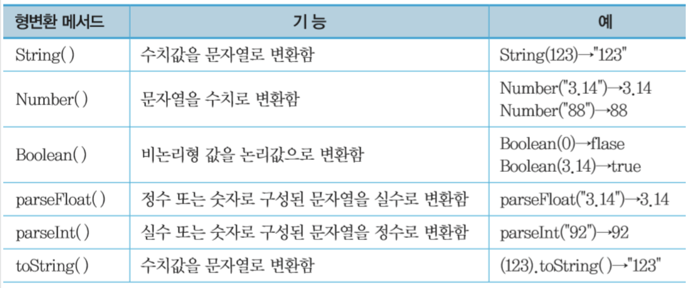

# JavaScript

스크립트형 언어는 함수를 기반으로 프로그램 시작과 끝이 있는것이 아닌 객체 하나에 대한 이벤트 처리만 가능하게 하는 언어

## JavaScript로 할 수 있는 것

- 웹 페이지 HTML 수정

```js
document.getElementById("target").innerHTML("<h1>바뀐 타이틀</h1>");
```

- 특정 HTML 태그의 속성값 변경

```js
document.getElementById("target").src = "new_image.jpg";
```

- 특정 HTML 태그의 스타일 변경

```js
document.getElementById("target").style.fontSize = "24px";
```

- 이벤트 처리 (마우스 클릭 이벤트 등)

```html
<button onclick="alert('버튼 눌러짐')">버튼</button>
```

## JavaScript 언어의 특징

- 인터프리터 언어
  > 인터프리터형 랭귀지(오류가 나면 멈춤)  
  > 컴파일러형 랭귀지(문법적인 오류가 없으면 실행파일 생성)
- 동적 타입 지원
- 객체 기반
- 함수형 프로그래밍 지원

## JavaScript 장점

- 서버 부하 감소: 클라이언트에서 JavaScript로 1차적인 입력 검사를 수행하면 불필요한 서버와의 통신을 줄일 수 있음
- 사용자 상호작용 향상: 사용자의 행동에 따라 즉각적인 반응을 서버 도움없이 처리 가능

## JavaScript 실행 흐름


## JavaScript 작성 위치

- \<script>태그 안에 작성
  - \<head>의 \<script> 태그
  - \<body>의 \<script> 태그
- inline 작성
  - 태그의 이벤트 속성 `(onclick="fun tion();")`
  - 링크 태그의 href속성 (`<a href="javascript.function()">함수실행</a>`)
- 외부 파일 작성
  - js/script.js 파일 작성 후 `<script src="js/script.js">`로 문서에 포함

## JavaScript로 출력하기

```js
console.log();

alert();

<button onclick="alert('버튼이 눌렸어요')">버튼</button>;
```

## JavaScript로 입력받기

```js
// prompt
var result = prompt("아이디를 입력하세요");
console.log(result);
document.write("입력하신 아이디는 " + result + " 입니댜");

//confirm
var result2 = confirm("회원 탈퇴를 하시겠습니까?");
document.write(result2);
```

## 기본 문법

### 변수 선언

- 변수는 변하는 데이터를 저장할 수 있는 메모리 공간(빈 상자)
- 변수 이름을 지을 때는 camelCase 방식 사용 권장
- 변수는 한번에 하나의 값만 저장할 수 있음(이전에 값이 있으면 덮어씀)
- 수치형, 문자열, 부울형, 객체형 등이 있음

기존에는 var를 이용하여 선언했지만 지금은
const, let 을 이용하여 변수를 선언한다.

let: 전역변수와 코드블록 안의 변수를 구분한다

#### typeof 변수의 속성을 나타낸다

```js
// number
var test = 1;
document.write(typeof test);

// string
var test = "1";
document.write(typeof test);

// boolean
var test = true;
document.write(typeof test);

// function
var test = function() {
  return 1;
};
document.write(typeof test);

// object
```

### 숫자형

```js
 <script>
        var x = 314e-2,
            y = 12345e10;
        var num1 = 999999999999999,
            num2 = 9999999999999999;
        document.write("x = " + x + "<br>");
        document.write("y =  " + y + "<br>");
        document.write("num1 =  " + (num1) + " <br> ");

        // 15자리 이상을 입력했을 때는 출력이 제대로 되지 않는다
        document.write("num2 =  " + (num2) + " <br> ");
        document.write("54 / 0  =  " + (54 / 0) + "<br> ");
        document.write("-54 / 0 = " + (-54 / 0) + " <br> ");

        // 숫자를 문자로 나눴을 때 NaN(Not a Number)을 출력한다
        document.write("88/’pi’ =  " + (88 / 'pi'));
    </script>
```

### boolean 형

- 참과 거짓을 저장 (true, false)
- 관계식이나 논리식으로 표현되고 조건문과 반복문에서 실행조건을 표현하는데 사용
- 0, -0, 공백문자열(""), undefind 변수, null 객체 : false
- 그 외의 값 : true

```js
<script>
   var state, num1=0, num2=88;
   var str1="";  str2="Javascript"
   var obj1 = null;
   var obj2 = new Object();

   document.write(Boolean(num1) + '<br>');
   document.write(Boolean(num2) + '<br>');
   document.write(Boolean(str1) + '<br>');
   document.write(Boolean(str2) + '<br>');
   document.write(Boolean(obj1) + '<br>');
   document.write(Boolean(obj2) + '<br>');
   document.write(Boolean(state) + '<br>');
</script>
```

### undefined 형

- 변수가 자료형을 결정할 수 없음을 나타내는 것
- 변수명 선언 후 아직 값을 저장하지 않았거나 변수값으로 undefined를 저장한 변수들
- undefined: 기본 자료형 변수가 비어있음을 나타냄
- null: 객체형 변수가 비어있음을 나타냄(자료형: object)

### typeof 연산자

- 인수의 자료형을 반환하는 연산자

```js
<script>
       document.write(typeof "John" + '<br>'); // 문자열
       document.write(typeof 3.14 + '<br>'); // 실수
       document.write(typeof NaN + '<br>'); // NaN
       document.write(typeof false + '<br>'); // 논리형
       document.write(typeof [1, 2, 3, 4] + '<br>'); // 배열
       document.write(typeof
           function () {} + '<br>'); // 함수
       document.write(typeof myCar + '<br>'); // 정의되지 않은 변수
       document.write(typeof null); // null
   </script>

```

### 형변환

- 특정 자료형의 값을 다른 자료형의 값으로 변환해서 나타내는 것
- 자동 형변환: 연산자들은 일정한 규칙을 가지고 자동으로 형 변환
- 명시적 형변환: 형변환 함수 이용



1. 자동 형변환  
   \-, \*, \/ 는 숫자로 형변환 시킨다

   ```js
   <script>
      document.write((7 + null) + '<br>');
      document.write(("7" + null) + '<br>');
      document.write(("7" + 2) + '<br>');
      document.write((2 + "7") + '<br>');
      document.write(("7" - 2) + '<br>');
      document.write((2 - "7") + '<br>');
      document.write(("7" * "2") + '<br>');
      document.write(("7" / "2") + '<br>');
      document.write(("abc" - 2) + '<br>');
      document.write(("abc" * 2) + '<br>');
      document.write(("abc" / 2) + '<br>');
   </script>
   ```

2. 강제 형변환

   ```js
    <script>
      var num1 = 3.145,
          num2 = 20,
          num3 = 100;
      var str1 = "58",
          str2 = "3.678",
          str3 = "javascript";
      var flag1 = true,
          flag2 = false;

      document.write(str1 + num2 + '<br>');
      document.write(Number(str1) + num2 + '<br>');
      document.write(parseInt(str1) + num2 + '<br>');
      document.write(parseInt(str2) + num2 + '<br>');
      document.write(parseInt(str3) + num2 + '<br>');
      document.write(parseFloat(str2) + num2 + '<br>');
      document.write(parseInt(num1) + num2 + '<br><hr>');
      document.write(num2 + num3 + '<br>');
      document.write(num2 + num3.toString() + '<br>');
      document.write(Boolean(num2) + num3.toString() + '<br>');
      document.write(str3 + Number(flag1) + '<br>');
      document.write(str3 + Number(flag2) + '<br>');
   </script>
   ```
