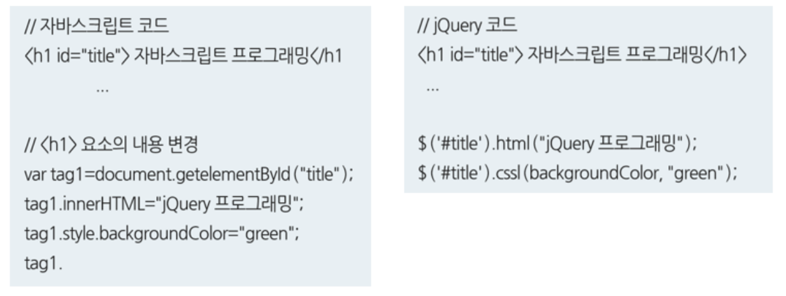
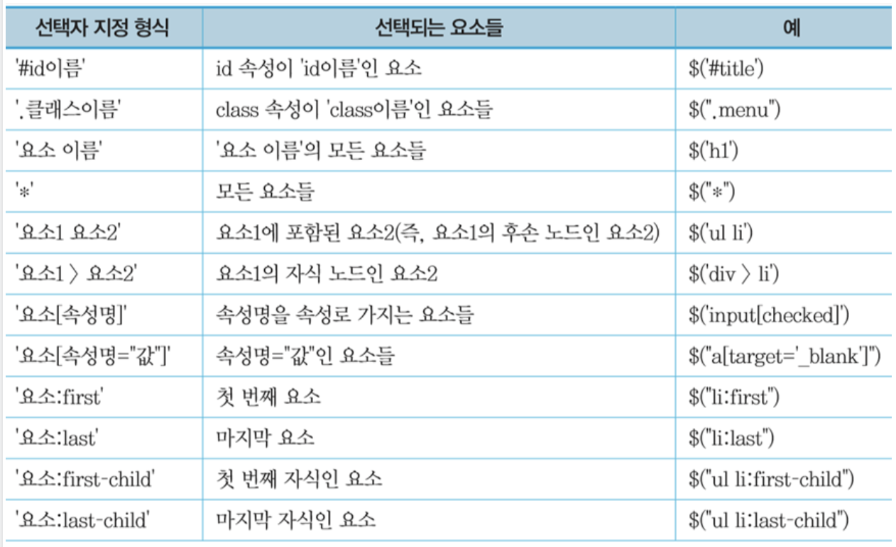
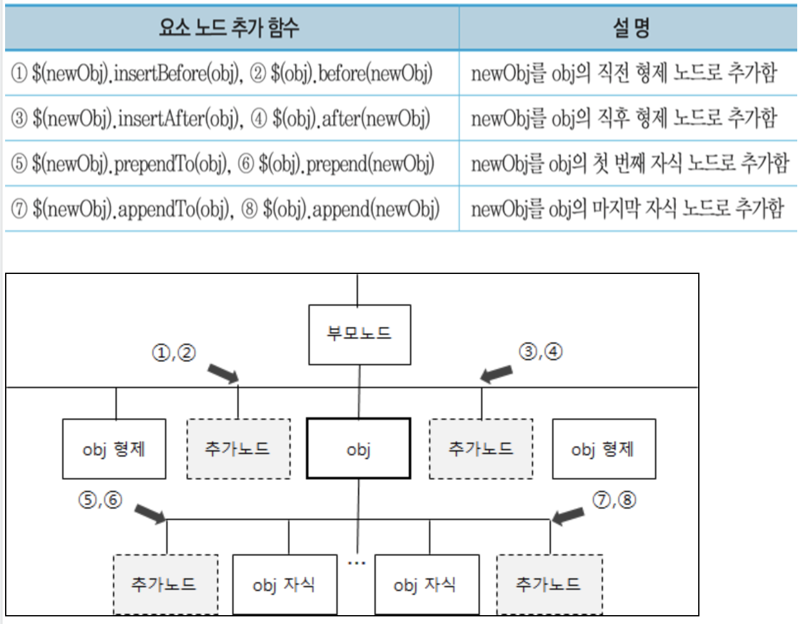

# jQuery

- 존 레식이 개발한 자바스크립트 라이브러리
- Write less, Do more

## jQuery 로 할 수 있는 일

- HTML 요소들의 내용이나 속성 변경
- HTML 요소들의 CSS3 스타일 속성변경
- HTML DOM 트리의 변경 (요소노드 추가, 삭제)
- HTML 요소들의 다양한 애니메이션 효과 지정
- 서버와의 비동기 통신(Ajax) 지원
- 웹브라우저 호환성 문제 해결

## 순수 Java Script 와 jQuery 비교



## jQuery 사용 방법

html \<head>태그에 삽입

```html
<head>
  <script src="https://ajax.googleapis.com/ajax/libs/jquery/3.4.1/jquery.min.js"></script>
</head>
```


jQuery 예제

```html
<!DOCTYPE html>
<html lang="en">
   <head>
       <title> jQuery 사용 예 </title>
       <!-- <script src='https://code.jquery.com/jquery-3.3.1.js'></script> -->
       <script src="https://ajax.googleapis.com/ajax/libs/jquery/3.4.1/jquery.min.js"></script>
   </head>

   <body>
       <h3 id="t1"> 자바스스크립트 프로그래밍 </h3>
       <hr>
       <button onclick="$('#t1').html('jQuery 프로그래밍'); ">
           내용변경
       </button>
       <button onclick="$('#t1').css('color','red'); ">
           스타일변경
       </button>
   </body>
</body>
</html>
```


## jQuery 선택자



## jQuery 주요 함수


## jQuery 적용 구조

```js
$(document).ready(function() {
  실행문;
});
$(function() {
  실행문;
});
```

```js
<!DOCTYPE html>
<html lang="ko">
<head>
   <title> jQuery 사용 예 </title>
   <script src="https://ajax.googleapis.com/ajax/libs/jquery/3.4.1/jquery.min.js"></script>
   <script>
       $(function () {
           jQuery 실행문
       });
   </script>
</head>
<body>

</body>
</html>
```

- 일반적으로 jQuery 코드들은 \$(document).ready(function() { … }); 안에 구현
- 모든 페이지가 다 로딩 된 후 jQuery 를 수행하는 것이 안전

## jQuery 선택자

### 태그 선택자

```html
<!DOCTYPE html>
<html>
  <head>
    <script src="https://ajax.googleapis.com/ajax/libs/jquery/3.4.1/jquery.min.js"></script>
    <script>
      $(document).ready(function() {
        $("button").click(function() {
          $("p").hide();
        });
      });
    </script>
  </head>

  <body>
    <h2>타이틀</h2>

    <p>This is a paragraph.</p>
    <p>This is another paragraph.</p>

    <button>클릭하면 사라짐</button>
  </body>
</html>
```

### id 선택자

```html
<!DOCTYPE html>
<html>
  <head>
    <script src="https://ajax.googleapis.com/ajax/libs/jquery/3.4.1/jquery.min.js"></script>
    <script>
      $(document).ready(function() {
        $("button").click(function() {
          $("#test").hide();
        });
      });
    </script>
  </head>

  <body>
    <h2>This is a heading</h2>

    <p>This is a paragraph.</p>
    <p id="test">This is another paragraph.</p>

    <button>Click me</button>
  </body>
</html>
```

### 클래스 선택자

```html
<!DOCTYPE html>
<html>
  <head>
    <script src="https://ajax.googleapis.com/ajax/libs/jquery/3.4.1/jquery.min.js"></script>
    <script>
      $(document).ready(function() {
        $("button").click(function() {
          $(".test").hide();
        });
      });
    </script>
  </head>

  <body>
    <h2 class="test">This is a heading</h2>

    <p class="test">This is a paragraph.</p>
    <p>This is another paragraph.</p>

    <button>Click me</button>
  </body>
</html>
```

## jQuery 이벤트


```html
<!DOCTYPE html>
<html lang="en">
  <head>
    <meta charset="UTF-8" />
    <meta name="viewport" content="width=device-width, initial-scale=1.0" />
    <meta http-equiv="X-UA-Compatible" content="ie=edge" />
    <title></title>
    <script src="https://ajax.googleapis.com/ajax/libs/jquery/3.4.1/jquery.min.js"></script>

    <script>
      $(function() {
        $("#btn1").mouseover(function() {
          $("#t1").css({ "font-size": "100px" });
          $(".classp").hide();
        });
        $("#btn2").click(function() {
          $("#t1").show();
          $(".classp").show();
        });
      });
    </script>
  </head>
  <body>
    <h3 id="t1">자바스스크립트 프로그래밍</h3>

    <p class="classp">fdsafdsafdsa</p>
    <p class="classp">fdsafdsafdsa</p>
    <p class="classp">fdsafdsafdsa</p>
    <p class="classp">fdsafdsafdsa</p>
    <div
      class="classp"
      style="width:100px; height:100px; background-color:red;"
    ></div>
    <hr />
    <button id="btn1">
      버튼1
    </button>
    <button id="btn2">
      버튼2
    </button>

    <script></script>
  </body>
</html>
```

### jQuery 이벤트 처리 (on 함수)

- on(), off() 함수 이용
- on() : 선택자로 지정된 요소에 이벤트와 이벤트 핸들러를 연결해서 이벤트 처리 등록
- off() : 등록된 이벤트 처리 제거


```js
$("p").on("click", function() {
  $(this).hide();
});

$("p").on({
  mouseenter: function() {
    $(this).css("background-color", "lightgray");
  },
  mouseleave: function() {
    $(this).css("background-color", "lightblue");
  },
  click: function() {
    $(this).css("background-color", "yellow");
  }
});
```

on()을 이용한 이벤트 등록

```html
<!DOCTYPE html>
<html>
  <head>
    <title>jQuery 사용 예</title>
    <script src="https://code.jquery.com/jquery-3.3.1.js"></script>
    <script>
      function f1() {
        $("#t1").html("jQuery 라이브러리");
      }

      function f2() {
        $("#t1").css("color", "red");
      }

      $(document).ready(function() {
        $("#b1").on("click", f1);
        $("#b2").on("click", f2);
      });
    </script>
  </head>

  <body>
    <h3 id="t1">자바스크립트 프로그래밍</h3>
    <hr />
    <button id="b1">내용변경</button>
    <button id="b2">스타일변경</button>
  </body>
</html>
```

on() 을 이용한 다중 이벤트 등록

```html
<!DOCTYPE html>
<html>
  <head>
    <title>jQuery 사용 예</title>
    <script src="https://code.jquery.com/jquery-3.3.1.js"></script>
    <script>
      $(document).ready(function() {
        $("#b1").on({
          click: function() {
            $("#t1").html("jQuery 라이브러리");
          },
          mouseover: function() {
            $("#t1").css("color", "red");
          }
        });
      });
    </script>
  </head>

  <body>
    <h3 id="t1">자바스크립트 프로그래밍</h3>
    <hr />
    <button id="b1">내용변경&스타일변경</button>
  </body>
</html>
```

jQuery 이벤트 처리 ( 이벤트별 작업 함수 - 자주 사용되는 이벤트에 대해 함수로 노출)


```js
$("p").dblclick(function() {
  $(this).hide();
});

$("#p1").mouseenter(function() {
  alert("You entered p1!");
});

$("#p1").mouseleave(function() {
  alert("Bye! You now leave p1!");
});

$("#p1").mousedown(function() {
  alert("Mouse down over p1!");
});

$("#p1").mouseup(function() {
  alert("Mouse up over p1!");
});

$("#p1").hover(
  function() {
    alert("You entered p1!");
  },
  function() {
    alert("Bye! You now leave p1!");
  }
);

$("input").focus(function() {
  $(this).css("background-color", "#cccccc");
});

$("input").blur(function() {
  $(this).css("background-color", "#ffffff");
});
```

### .click() 함수

```html
<!DOCTYPE html>
<html>
  <head>
    <title>jQuery 사용 예</title>
    <script src="https://code.jquery.com/jquery-3.3.1.js"></script>
    <script>
      function f1() {
        $("#t1").html("jQuery 라이브러리");
      }
      function f2() {
        $("#t1").css("color", "red");
      }
      $(document).ready(function() {
        $("#b1").click(f1);
        $("#b2").click(function() {
          $("#t1").css("color", "red");
        });
      });
    </script>
  </head>
  <body>
    <h3 id="t1">자바스크립트 프로그래밍</h3>
    <hr />
    <button id="b1">내용변경</button>
    <button id="b2">스타일변경</button>
  </body>
</html>
```

### .hover(f1, f2) 함수

```html
<!DOCTYPE html>
<html>
  <head>
    <title>jQuery 사용 예</title>
    <script src="https://code.jquery.com/jquery-3.3.1.js"></script>
    <script>
      $(document).ready(function() {
        $("#b1").hover(
          function() {
            $("#t1").html("jQuery 라이브러리");
            $("#t1").css("color", "red");
          },
          function() {
            $("#t1").css("color", "black");
          }
        );
      });
    </script>
  </head>
  <body>
    <h3 id="t1">자바스크립트 프로그래밍</h3>
    <hr />
    <button id="b1">내용변경&스타일변경</button>
  </body>
</html>
```

## jQuery 효과

### jQuery 시각 효과


```js
$("#hide").click(function() {
  $("p").hide();
});

$("#show").click(function() {
  $("p").show();
});

$("button").click(function() {
  $("p").hide(1000);
});

$("button").click(function() {
  $("p").toggle();
});
```

### fadeIn / fadeOut

```js
$(selector).fadeIn(speed, callback);
$(selector).fadeOut(speed, callback);
$(selector).fadeToggle(speed, callback);
$(selector).fadeTo(speed, opacity, callback);
```

```html
<!DOCTYPE html>
<html>
  <head>
    <script src="https://ajax.googleapis.com/ajax/libs/jquery/3.4.1/jquery.min.js"></script>
    <script>
      $(document).ready(function() {
        $("button").click(function() {
          $("#div1").fadeIn();
          $("#div2").fadeIn("slow");
          $("#div3").fadeIn(3000);
        });
      });
    </script>
  </head>

  <body>
    <p>Demonstrate fadeIn() with different parameters.</p>

    <button>Click to fade in boxes</button><br /><br />

    <div
      id="div1"
      style="width:80px;height:80px;display:none;background-color:red;"
    ></div>
    <br />
    <div
      id="div2"
      style="width:80px;height:80px;display:none;background-color:green;"
    ></div>
    <br />
    <div
      id="div3"
      style="width:80px;height:80px;display:none;background-color:blue;"
    ></div>
  </body>
</html>
```

```js
$("button").click(function() {
  $("#div1").fadeOut();
  $("#div2").fadeOut("slow");
  $("#div3").fadeOut(3000);
});

$("button").click(function() {
  $("#div1").fadeToggle();
  $("#div2").fadeToggle("slow");
  $("#div3").fadeToggle(3000);
});

$("button").click(function() {
  $("#div1").fadeTo("slow", 0.15);
  $("#div2").fadeTo("slow", 0.4);
  $("#div3").fadeTo("slow", 0.7);
});
```

### 애니메이션 처리 효과


```js
$(selector).animate({ params }, speed, callback);

$("button").click(function() {
  $("div").animate({ left: "250px" });
});

$("button").click(function() {
  $("div").animate({
    left: "250px",
    opacity: "0.5",
    height: "150px",
    width: "150px"
  });
});

// using relative value

$("button").click(function() {
  $("div").animate({
    left: "250px",
    height: "+=150px",
    width: "+=150px"
  });
});

// using queue

$("button").click(function() {
  var div = $("div");
  div.animate({ height: "300px", opacity: "0.4" }, "slow");
  div.animate({ width: "300px", opacity: "0.8" }, "slow");
  div.animate({ height: "100px", opacity: "0.4" }, "slow");
  div.animate({ width: "100px", opacity: "0.8" }, "slow");
});
```

## jQuery 이용 동적 문서 작성 (객체 조작)

### 객체 조작 관련 주요 함수


### HTML 요소의 내용 변경


### HTML 요소의 속성 변경


### HTML 요소의 추가, 삭제


### HTML 요소 생성


### HTML 요소 객체 추가



## jQuery 요소 탐색

$(선택자).parent();  
$(선택자).parents();  
$(선택자).children(선택자);  
$(선택자).find(선택자);  
$(선택자).siblings(선택자);  
$(선택자).next(선택자);  
$(선택자).prev(선택자);  
$(선택자).closest(선택자);

```html
<div class="box">
  <div class="something1"></div>
  <div class="something2">
    <a class="mylink">My link</a>
  </div>
</div>

$(".mylink").click(function() { // 아래 4개는 모두 동일한 결과 반환
$(this).parent().siblings(".something1"); $(this).parent().prev(); // if you
always want the parent's previous sibling
$(this).parents(".box").children(".something1");
$(this).closest('.box').children('.something1'); }); - closest()는 모든 부모
요소를 대상으로하여 원하는 요소만 선택자로 가져올 수 있다. - 하나가 아닌 모든
부모 요소를 반환할 필요가 있다면 parents() 메소드를 사용한다. - parent()는 해당
요소의 바로 위의 부모 요소를 반환한다. - children()은 해당 요소의 바로 아래 자식
요소들만을 반환한다. - find()는 해당 노드 아래의 전체 DOM을 탐색하여 반환한다. -
prev() - 이전 요소를 선택하도록 반환한다. - next() - 다음 요소를 선택하도록
반환한다.
```

```html
<!DOCTYPE html>
<html lang="en">
  <head>
    <meta charset="UTF-8" />
    <meta name="viewport" content="width=device-width, initial-scale=1.0" />
    <meta http-equiv="X-UA-Compatible" content="ie=edge" />
    <title>Document</title>
    <script src="https://ajax.googleapis.com/ajax/libs/jquery/3.4.1/jquery.min.js"></script>
    <script>
      $(function() {
        // $('.level-1').find('ul').css({
        //     'color': 'red' });
        // item-2의 parent-부모에 append를 하라. 결과는 item-2의 부모인 level-3 밑에 append 조건으로 생성
        // $('.item-2').parent().append('<li class="item-c">test</li>');
        // level-1의 바로 자식들 children에 모두 append하여 생성
        // $('.level-1').children().append('<li class="item-c">go</li>');
        // level-1의 자식들 중 클래스가 item-i를 선택하고 append하여 생성
        // $('.level-1').children(".item-i").append('<li class="item-c">goto</li>');
        // 형제들을 모두 선택
        // $('.item-a').siblings().append('<li class="item-c">goto</li>');
        // 형제들 중 item-b 클래스를 선택
        //$('.item-a').siblings(".item-b").append('<li class="item-c">goto</li>');
        // item-ii 다음(item-iii)에 append 하여 붙이기
        // $('.item-ii').next().append('<li class="item-c">goto</li>');
        // 바로 위의 요소 중 ul를 찾아 선택하고 append하여 붙여넣기
        // $('.item-a').closest('ul').append('<li class="item-c">goto</li>');
      });
    </script>
  </head>

  <body>
    <ul class="level-1">
      <li class="item-i">I</li>
      <li class="item-ii">
        II
        <ul class="level-2">
          <li class="item-a">A</li>
          <li class="item-b">
            B
            <ul class="level-3">
              <li class="item-1">1</li>
              <li class="item-2">2</li>
              <li class="item-3">3</li>
            </ul>
          </li>
          <li class="item-c">C</li>
        </ul>
      </li>
      <li class="item-iii">III</li>
    </ul>
  </body>
</html>
```

---

## 실습

- 이름, 전화번호, 주소 를 입력받아 리스트에 추가하는 전화번호부를 작성하시오
- 각 사용자 정보는 객체 배열을 이용해 저장하고
- jQuery after나 append기능을 이용할것

```html
<!DOCTYPE html>
<html lang="en">
  <head>
    <meta charset="UTF-8" />
    <meta name="viewport" content="width=device-width, initial-scale=1.0" />
    <meta http-equiv="X-UA-Compatible" content="ie=edge" />
    <title>Document</title>

    <head>
      <script src="https://ajax.googleapis.com/ajax/libs/jquery/3.4.1/jquery.min.js"></script>
    </head>
    <style>
      div {
        display: inline-block;
      }

      ul {
        list-style-type: none;
      }

      #cname {
        width: 50px;
      }

      #cphone {
        width: 100px;
      }

      #caddr {
        width: 300px;
      }
    </style>
  </head>

  <body>
    <h2>연락처</h2>
    <table>
      <tr>
        <td>이름 :</td>
        <td><input type="text" name="name" id="name" /></td>
      </tr>
      <tr>
        <td>전화번호 :</td>
        <td><input type="number" name="phone" id="phone" /></td>
      </tr>
      <tr>
        <td>주소 :</td>
        <td><input type="text" name="address" id="addr" /></td>
      </tr>
    </table>

    <button onclick="contact();" id="btn">입력</button>
    <hr />
    <ul id="list"></ul>

    <script>
      function contact() {
        var contact;
        var addContact;
        var name = document.getElementById("name").value;
        var phone = document.getElementById("phone").value;
        var address = document.getElementById("addr").value;
        contact = {
          name: name,
          phone: phone,
          address: address
        };
        console.log(contact);
        console.log(contact.name);

        addContact =
          '<div id="cname">' +
          contact.name +
          '</div><div id="cphone">' +
          contact.phone +
          '</div><div id="caddr">' +
          contact.address +
          "</div>";

        $("ul").append("<li>" + addContact + "</li>");

        // 입력란 값을 공백으로 바꾼다
        document.getElementById("name").value = "";
        document.getElementById("phone").value = "";
        document.getElementById("addr").value = "";
      }
    </script>
  </body>
</html>
```

만약 삭제 기능을 추가하고 싶다면
아래 코드를 참조해보자

```html
<html lang="en">
  <head>
    <meta charset="UTF-8" />
    <meta name="viewport" content="width=device-width, initial-scale=1.0" />
    <meta http-equiv="X-UA-Compatible" content="ie=edge" />
    <title>Document</title>
    <script
      type="text/javascript"
      src="https://code.jquery.com/jquery-3.1.1.min.js"
    ></script>
    <script type="text/javascript">
      $(function() {
        $("#addTR").click(function() {
          var row = "<tr>";
          row += "<td><input type='text' name='idx[]' value='' /></td>";
          row += "<td><span>날 누르면 삭제가 됨</span></td>";
          row += "</tr>";
          $("#table").append(row);
        });

        $("#table").on("click", "span", function() {
          $(this)
            .closest("tr")
            .remove();
        });
      });
    </script>
  </head>

  <body>
    <button id="addTR">날 누르면 추가가 됨</button>
    <table id="table">
      <tr>
        <td><input type="text" /></td>
      </tr>
    </table>
  </body>
</html>
```
