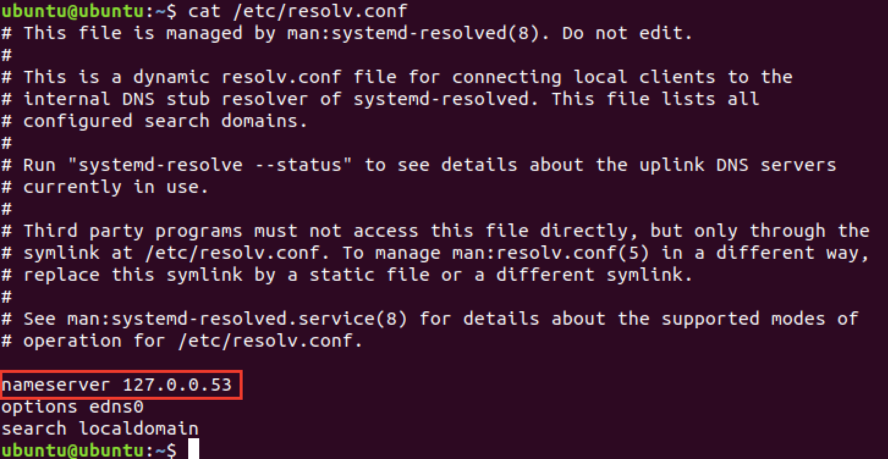
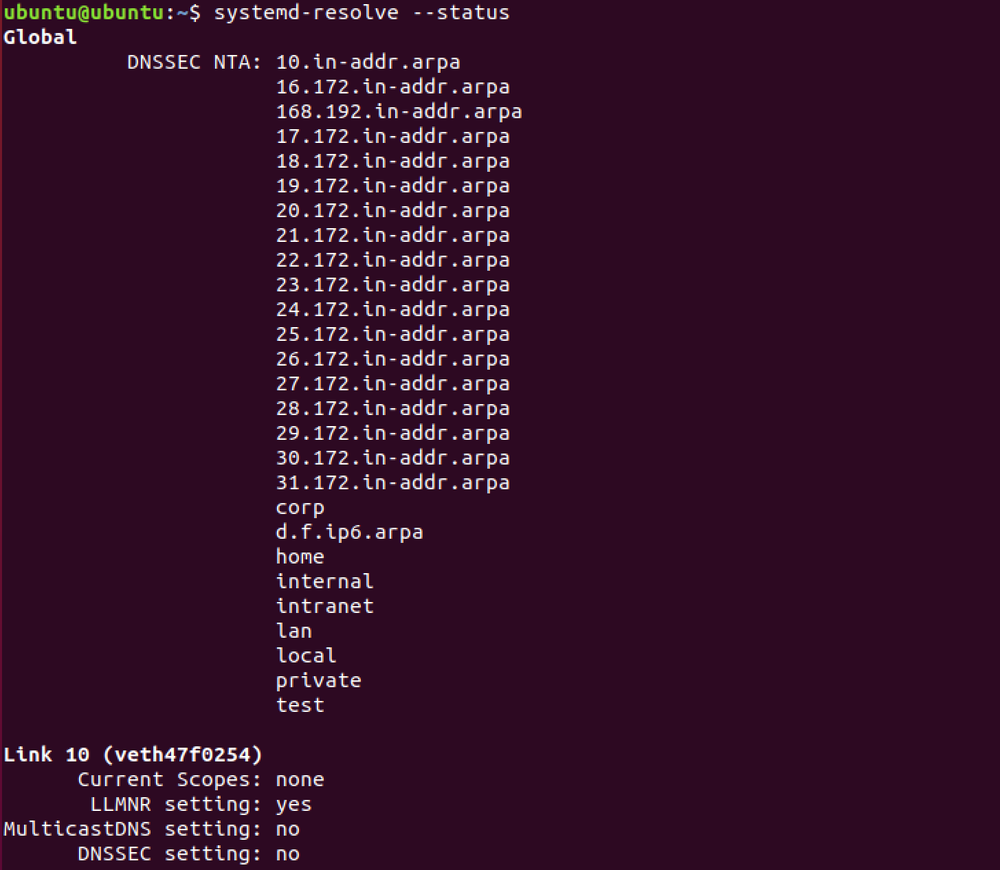

# DNS 서버 설치하기

## 네임서버 확인

```bash
# 네임서버의 IP 정보를 확인
nslookup

# 현재 Server에 설정되어 있는 네임 서버 확인
> server

# google ip 확인
> www.google.com

# blochaid ip 확인
> blochaid.io
```


```bash
# 네임서버가 설정된 파일을 확인한다
cat /etc/resolv.conf
```


resolv.conf 파일을 잘못 수정하면 도메인을 ip로 변환할 수 없으므로 인터넷 연결이 되지 않는다

```bash
# resolve 상태를 확인한다. uplink DNS 서버에 대한 상태를 알려준다
systemd-resolve --status
```



uplink DNS 를 바꾸려면 `systemd-resolve` 데몬이 이를 수행하는데, 다음과 같은 위치의 파일들을 읽어서 동작한다

```bash
/etc/systemd/resolved.conf
/etc/systemd/resolved.conf.d/*.conf
/run/systemd/resolved.conf.d/*.conf
/usr/lib/systemd/resolved.conf.d/*.conf
```

Ubuntu 18.04 에서는 `/etc/systemd/resolved.conf` 파일이 존재한다

```bash
sudo vim /etc/systemd/resolved.conf
```


`DNS=` 행에 DNS 서버를 `space`로 구분해서 리스트로 적어놓을 수 있다

`DNS=8.8.8.8` 을 입력하고 `systemctl restart systemd-resolved`를 하면 적용된다
