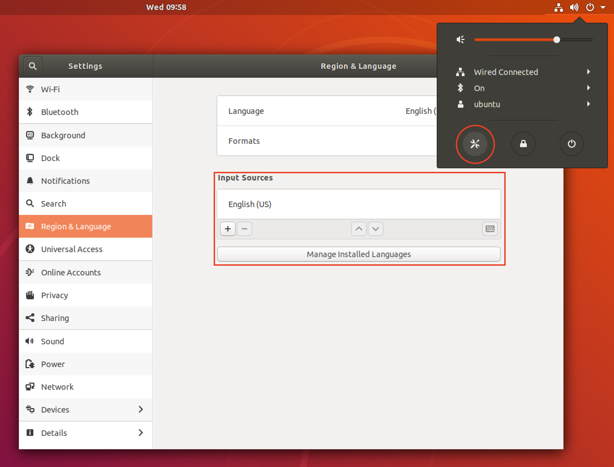
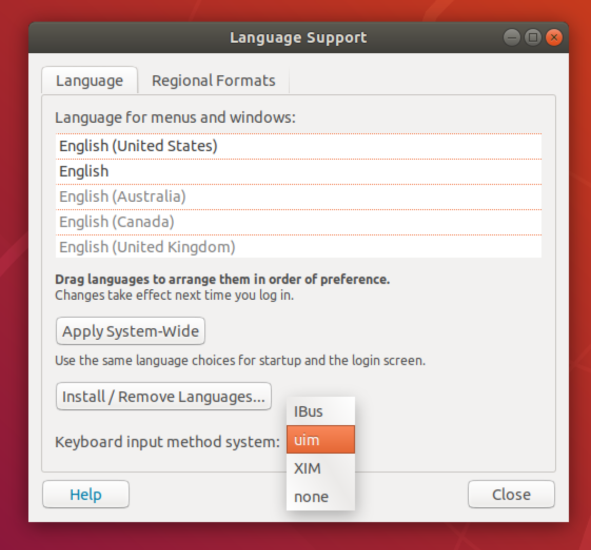
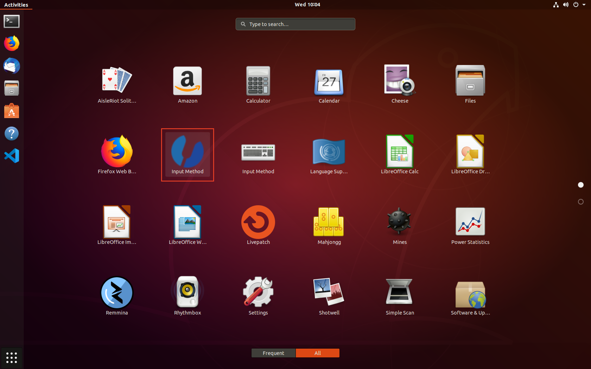
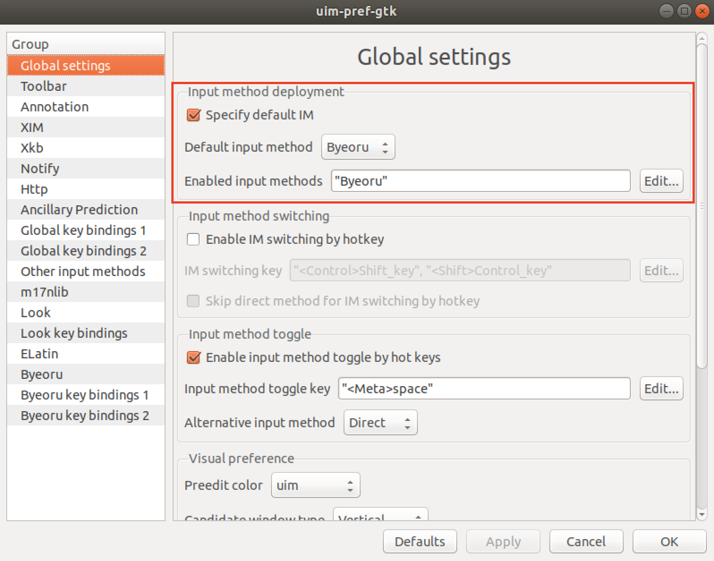
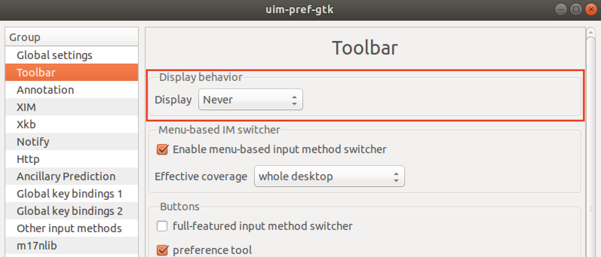

# ubuntu 18.04 한글 입력기 설치

<http://progtrend.blogspot.com/2018/06/ubuntu-1804-uim.html>

우분투 18.04에서 한글입력기 설정 문제가 있어서 검색해본 결과 위 블로그 사이트에 자세하게 설명이 되어있어서 그대로 따라 했더니 아주 잘 된다.

간략하게 정리해보자

## uim 패키지 설치

```bash
# uim 패키지 설치
sudo apt install uim

# 만약 삭제하려면 아래 명령어를 입력한다
sudo apt remove uim
sudo apt autoremove
```


설정 -> Rigion & Language  
input sources에 English(US)만 남겨둔다


Keyboard input method system을 uid로 변경해준다


input method 애플리케이션을 실행한다



- Specify default IM 체크박스를 선택
- Default input method : Byeoru 선택
- Enabled input methods : "Byeoru"만 남겨둔다


Toolbar -> Display behavior  
Display : Never로 선택


단축키 중복 충돌을 위해 위와같이 설정하자


위와 같이 설정  
그리고 터미널을 열고 아래 명령어를 입력한다

```bash
// 오른쪽 Alt키의 기본 키 맵핑을 제거하고 'Hangul'키로 맵핑
$ xmodmap -e 'remove mod1 = Alt_R'
$ xmodmap -e 'keycode 108 = Hangul'

// 오른쪽 Ctrl키의 기본 키 맵핑을 제거하고 'Hangul_Hanja'키로 맵핑
$ xmodmap -e 'remove control = Control_R'
$ xmodmap -e 'keycode 105 = Hangul_Hanja'

// 키 맵핑 저장
$ xmodmap -pke > ~/.Xmodmap
```

만약 재부팅시 xmodmap이 초기화되면 아래와 같이 파일을 작성하고 Startup application에서 시작 프로그램을 등록해주자

/home/ubuntu/hangul

```bash
sh -c "xmodmap -e 'remove mod1 = Alt_R' & xmodmap -e 'keycode 108 = Hangul' & xmodmap -e 'remove control = Control_R' & xmodmap -e 'keycode 105 = Hangul_Hanja' "
```


